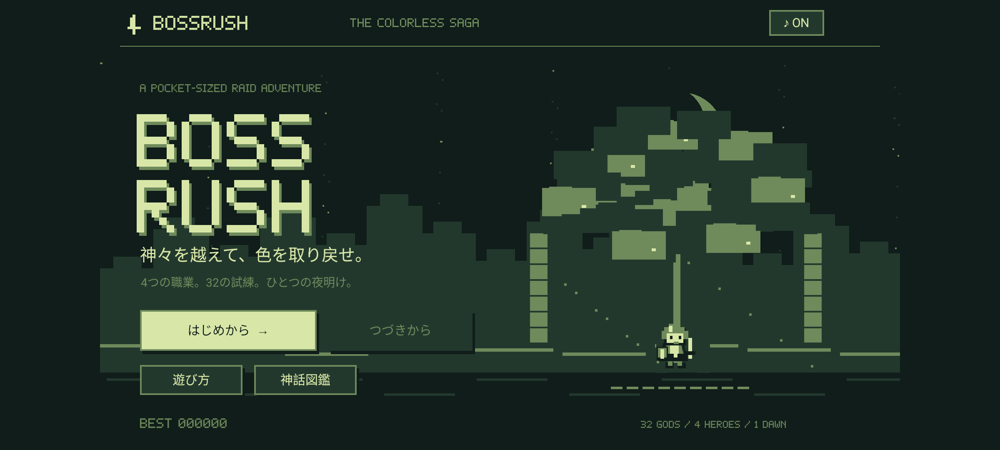
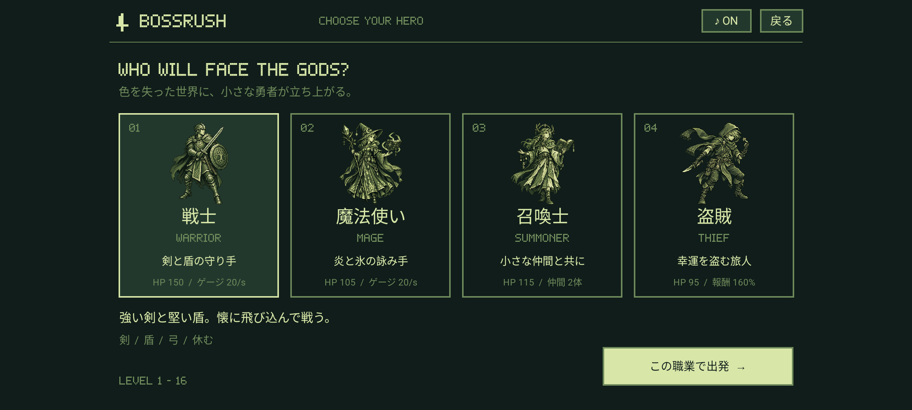
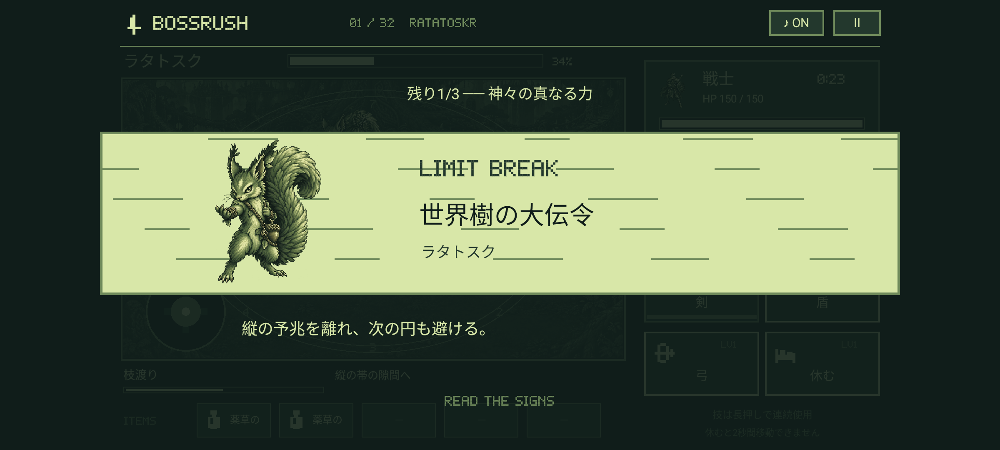
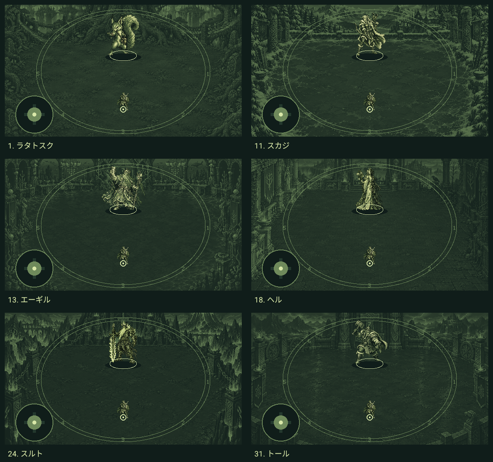
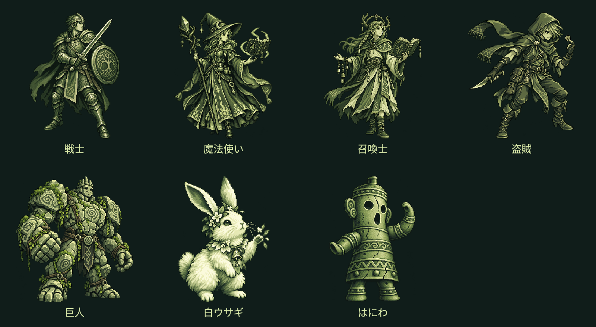

# BOSSRUSH

**神々を越えて、色を取り戻せ。**

ゲームボーイ風の緑色のピクセルアートで描く、Android向けの2Dボス連戦アクションゲームです。戦場に表示される予兆を読み、安全地帯に移動しながら4つの技とアイテムで戦います。4職業から主人公を選び、北欧神話をモチーフとする32体のボスを倒して、世界に色を取り戻します。



FF14のレイドバトルに着想を得た、独自のゲーム・キャラクター画像・楽曲です。既存ゲームの画像、音源、キャラクター、技名を流用していません。

## 世界に色を取り戻す物語

1.0.15で「はじめから」に**序章・全32話・終章**を追加しました。主人公は4職業から選ぶ旅人。故郷の布の色を思い出すため、空の旅灯を携え、色を支配する神々とその眷属に挑みます。北欧神話の役割や逸話をもとに、忠義・怒り・愛・恐れから旅人へ敵対する姿を、各ボスの戦闘前と撃破後の対話で描きます。

序章から始まり、対峙→ボス紹介→戦闘→強化・戦利品の確定→撃破後の物語→ショップ、と進行。集めた32色を旅灯の一覧で確認でき、最後の封印を解くと世界がカラーになり、終章へ進みます。会話は「次へ」「前のページ」「この場面をスキップ」で操作し、途中のページから再開できます。既存の保存データも、現在のボスから合流できます。

物語とゲーム内の日本語表示に**8×8ドットの美咲ゴシック**を採用。会話本文はドットを保って拡大し、不透明な枠に最大4行で表示します。173ページの物語は自分のペースで読め、コントローラーでもページを送れます。[物語・原典・フォントの説明](docs/STORY.md)、[全32話の台本](docs/STORY_SCRIPT.md)、[検証記録](docs/STORY_VALIDATION.md)を参照してください。

## 動作環境

- Android 8.0以上（minSdk 26）、横画面。ターゲットSDK 36。
- KotlinとAndroid Canvasによるネイティブ実装。ゲームエンジンSDK・WebView不使用。
- 通信・アカウント・広告・課金なし。インターネット権限なし。
- 左側のタッチスティックと右側の技ボタンを同時に操作できます。
- 外部コントローラー対応：左スティック／十字キーで移動、A・B・X・Yで技1〜4、L1／R1でアイテム選択、L2で使用確認、STARTで一時停止。メニューは方向入力とAで決定、Bで戻ります。[操作の詳細](docs/CONTROLS.md)。
- 物理キーボードではWASD / 矢印キーで移動、1〜4で技、Escで一時停止。メニューはWASD / 矢印キーとEnterで選択・決定。
- メニューと技・アイテムのボタンにはアクセシビリティ用の操作ノードがあります。戦場の空間的な予兆の理解には画面の視認が必要です。

## 遊び方

1. 「はじめから」で職業を選び、「この職業で出発」。
2. 序章とボスとの対話を読み、ボス紹介で攻略の手掛かりを確認して「戦闘開始」。
3. 戦場の左半分をドラッグして移動。攻撃はボスの方向を自動で狙います。技はタップでも長押しでも使用できます。
4. **斜線は危険地帯**です。円形・扇形・直線・十字・ドーナツ型などの予兆が確定すると攻撃が発生します。突進は予兆の完了後にボス本体が走り、接触するとダメージを受けます。
5. **月印と白いルーンの円は中へ**。ドーナツは内側へ。吹き飛ばし前には中央へ。前後の連続攻撃は切り返します。足元の小さな円が主人公の当たり判定です。
6. 下のアイテムを選ぶと時間が止まり、効果を確認して使用できます。4番目の技は、HPが最大値の3分の1以下のとき、各ボス戦で1回だけ使える必殺技です。回復は薬草や白ウサギを使います。
7. 撃破後に強化する技を1つ選択。別の技へ選び直したり、「技の選択をキャンセル」で取り消したりできます。「物語のつづきへ」で強化を確定し、撃破後の物語へ進みます。盗賊は特殊アイテムも1つ選びます。

全32体のボスが**突進・飛び込み・回り込み・瞬間移動**を行います。黄金の猪や狼は進路を予告して突進し、トールは雷鎚を構えて飛び込み、弓使いは距離を取りながら回り込みます。ロキなどの幻術系はルーンを残して瞬間移動します。突進は帯の横へ、飛び込みは着地点の円の外へ避けて、移動後のボスを狙いましょう。[全32体の移動と攻撃](docs/COMBAT.md)。

## 4つの職業



| 職業 | HP | 技1 | 技2 | 技3 | 技4 | 特徴 |
| --- | ---: | --- | --- | --- | --- | --- |
| 戦士 | 150 | 剣 | 盾 | 弓 | 瞬刃十連 | 剣は近接高威力。盾で軽減、離れたら弱い弓 |
| 魔法使い | 105 | 炎 | 氷 | 魔力を高める | 終焔五重奏 | 炎は直進・着弾範囲攻撃。氷は短時間追尾後に地点を固定 |
| 召喚士 | 115 | 巨人を呼ぶ | 白ウサギを呼ぶ | はにわを呼ぶ | 五巨人の進軍 | 通常2体＋必殺技の巨人5体。巨人は自動攻撃、ウサギは回復、はにわは最大4回の身代わり |
| 盗賊 | 95 | ナイフ | 盗む | 気合いをいれる | 無影の極意 | 低めのHP・攻撃。撃破金1.6倍、特殊品の確定報酬と盗み |

ゲージ上限は100。戦士・魔法使い・盗賊は毎秒20、召喚士は**毎秒10**回復します。巨人と白ウサギの召喚は初期12秒、成長で最大20秒です。

**はにわはLv.1で耐久1回・5秒、Lv.16で耐久4回・20秒。** 耐久はLv.6で2回、Lv.11で3回、Lv.16で4回となり、持続時間は1レベルごとに1秒伸びます。出現中に召喚士がダメージを受けると、方向・範囲・通常技／必殺技を問わず、その1回分をすべて肩代わりして耐久を1消費します。耐久が0になるか、持続時間が切れると消滅します。攻撃が重なれば1発ずつ耐久を使い、使い切った後の攻撃は通常どおり判定します。既に無敵・透明化で防いだ攻撃では消費しません。再タップの近接攻撃で寿命や耐久は回復しません。

1.0.17で白ウサギの回復量を**Lv.1の8からLv.16の16まで直線成長**する値へ調整しました。1レベルごとに約0.533ずつ増え、Lv.8は約11.73です。小数の回復量もHPに反映します。2秒ごとの回復間隔・回復範囲・召喚時間は従来どおりです。[召喚の成長仕様と検証](docs/SUMMON_GROWTH.md)。

4番目の必殺技はゲージ消費なし。戦士は約0.15秒の10連続強攻撃、魔法使いは全域へ5回の爆発、召喚士は通常枠とは別に巨人5体、盗賊は10秒間の透明化・無敵です。使用後は回復・再度の瀕死・砂時計でも再使用できません。次のボス戦で使用回数が戻ります。[必殺技の仕様・成長・検証](docs/PLAYER_FINISHERS.md)。

## 技の成長と30秒基準

全技はLv.1開始、最大Lv.16。撃破ごとに1つだけレベルを上げられます。

強化画面で技を選択すると、選択中の枠と強化後の効果を表示します。この時点ではレベルや保存データを変更しません。別の技へ選び直せます。キャンセルボタン、Androidの「戻る」、コントローラーのB／キーボードのEscで選択を取り消せます。「物語のつづきへ」で、最後に選んだ技だけを1レベル上げます。盗賊は特殊アイテムの受け取りも必要ですが、技の選び直しで受け取ったアイテムは失われません。

攻撃威力・待機時間・範囲と、召喚の成長は以下の通りです。

```text
成長進行度 t = (Lv - 1) / 15
威力係数 = 0.25 + 0.05 × (Lv - 1)
待機時間 = 初期待機時間 × (1 - 0.45 × t)
技範囲 = 初期範囲 × (1 + 0.60 × t)
白ウサギの回復量 = 8 + 8 × t
はにわの耐久回数 = 1 + floor((Lv - 1) / 5)
はにわの持続時間 = 5 + (Lv - 1) 秒
```

Lv.1の攻撃威力は最大の25%、Lv.16では100%。白ウサギの回復量はLv.1を8に保つため、最大16の50%から成長します。盾の軽減率は最大75%×威力係数、魔力強化の追加倍率は最大50%×威力係数、盗賊の速度上昇は最大80%×威力係数です。これらの持続時間も直線的に増加します。はにわの耐久は整数回のため段階的に増えます。

**技の成長は見た目にも反映されます。** 剣・ナイフの斬撃が広がって重なり、炎は大きな火球と火柱、氷は多数の結晶へ成長します。矢の幅と射程、巨人の拳とはにわの打撃範囲、白ウサギの回復範囲も技レベルに連動します。召喚時の紋章、盾・魔力・気合い・盗み・休息の演出も段階的に豊かになります。成長した攻撃の残光で追加ダメージが発生することはありません。強化画面で威力・待機時間に加え、範囲や矢幅を確認できます。[全技の成長と演出](docs/SKILL_GROWTH.md)。

後のボスほど強くなるため、別枠のステージ補正として主人公の攻撃に `1 + 0.10 × ボス番号（0始まり）` を掛けます。技単体のレベル曲線と区別しています。

戦闘開始時に、**実際の職業・技レベル・ゲージ・待機・飛翔・召喚時間を使い、静止したボスに30秒間攻撃する内部シミュレーション**を実行し、そのダメージ合計をボスHPの基準にします。戦士は剣と弓、魔法使いは強化・炎・氷、召喚士は巨人、盗賊はナイフを使用します。攻撃アイテム、回避時間、主人公の必殺技、ボスの必殺技演出は試算に含めません。HPは前のボスの102.5%以上を下限にしています。

これは各育成状態の攻撃機会をそろえる目安です。実際の所要時間は位置取り・回避・技の選択で変化します。カットインと一時停止中は戦闘時計を止めます。ボスの基礎攻撃力は `15 + 1.35 × ボス番号 + 0.010 × ボス番号²`、必殺技はその1.65倍。予兆には、通常速度で安全地帯へ届くための猶予を設けています。

## ショップと盗賊の戦利品

**かばんは通常・特殊を合わせて5個**。すべて使い切りです。店で所持品を選ぶと、確認して手放せます。

| 通常アイテム | 価格 | 効果 |
| --- | ---: | --- |
| 薬草のしずく | 35 G | 最大HPの45%回復 |
| 力の霊薬 | 45 G | 8秒間、攻撃力1.5倍 |
| 石肌の霊薬 | 40 G | 8秒間、被ダメージ半減 |
| 風の霊薬 | 35 G | 8秒間、移動速度1.5倍 |

| 特殊アイテム | 効果 |
| --- | --- |
| 隠れ身のマント | 6秒間、透明化して無敵 |
| 三影の鏡 | 8秒間、本人＋分身2人の3人になり、合計攻撃力2倍 |
| 黄金の印 | 現在のボスの撃破金を3倍。重複使用不可 |
| 時戻しの砂時計 | 全技の待機時間とゲージを即時回復 |

盗賊はボス撃破時に特殊品を4択で1つ入手します。満杯なら所持品と交換できます。「盗む」は各ボス1回だけ、射程内で確定成功し、そのボス番号と技レベルに対応する特殊品を得ます。満杯のときは失敗扱いにせず、枠を空けてから実行できます。4種類目の砂時計は、制作時のユーザー指定に基づく追加です。

## ボスごとの通常攻撃と覚醒

全32体に合計66種類の専用通常攻撃があります。ムニンは過去の位置への追撃、スカジは予兆ごとに再照準する狙撃、ラーンは縦横に閉じる網、トールは鎚から返ってくる雷、オーディンは槍・二羽の鴉・ルーンを組み合わせます。序盤の単発中心から、終盤は三〜四段の連撃へ進みます。後半ほど攻撃力が上がり、予兆と攻撃間隔も短くなります。移動が間に合う予兆の猶予を計算しています。

HP1/2で初回の必殺技を発動した後は、通常技を1〜3回挟み、必殺技をランダムに再使用します。カットインは各戦闘の初回だけです。2回目以降は戦闘と移動を止めず、予兆から発動します。通常技の選択も覚醒後はランダムになります。必殺技には各ボス専用の鮮やかな2色を使い、光柱・光線・属性の破片を追加しました。HP1/4以下では、各通常技の段や必殺技へ別の固有技の一撃を重ねる「二重詠唱」に移ります。基準となる発動間隔・連撃の間隔・予兆時間を従来の半分にし、4職業の移動速度を1.2倍にしました。共通の安全地点への移動に足りない場合は予兆を延ばします。カットインは世界樹、石造の神殿、組紐、神ごとの紋章を描いたドット絵で、攻撃の主色と連動します。[全32体の通常攻撃・難易度・覚醒後の仕組み](docs/COMBAT.md)を参照してください。

## 32体の神々と眷属

8つの地域に4体ずつ配置しています。全ボスに固有名・神話の説明・通常技・HP1/2でのカットイン付き必殺技・専用テーマ曲があります。原典の属性を使った**創作上の戦闘表現**であり、すべての登場存在を敵・邪神と解釈したものではありません。図鑑は最初から全32体を閲覧できます。



| # | ボス | 神話のモチーフ | 専用BGM |
| --- | --- | --- | --- |
| 01 | ラタトスク | 世界樹を走る伝令のリス | 枝先のいたずら |
| 02 | ダーイン | 世界樹の葉を食む鹿 | 翠枝の角笛 |
| 03 | グリンブルスティ | フレイの黄金の猪 | 黄金の蹄 |
| 04 | フギン | オーディンの思考の鴉 | 黒翼の問い |
| 05 | ムニン | オーディンの記憶の鴉 | 忘れられた空 |
| 06 | タングリスニ | 雷神の戦車を曳く山羊 | 雷雲の蹄音 |
| 07 | スコル | 太陽を追う狼 | 日蝕の疾走 |
| 08 | ハティ | 月を追う狼 | 銀月の追走 |
| 09 | フレースヴェルグ | 翼から風を起こす大鷲 | 北端の風鳴り |
| 10 | スィアチ | 鷲の姿で林檎を奪う巨人 | 奪われた春 |
| 11 | スカジ | 雪山・スキー・狩猟 | 白銀を射る |
| 12 | ウル | 弓・スキー・盾 | イチイの弦 |
| 13 | エーギル | 海と宴 | 荒波の祝宴 |
| 14 | ラーン | 海に落ちた者を捕らえる網 | 深海の糸 |
| 15 | ニョルズ | 風・海・航海 | 帰港なき帆 |
| 16 | ヨルムンガンド | 世界を囲む毒の大蛇 | 世界を締める環 |
| 17 | ガルム | 冥界に結びつく犬 | 鎖の向こう |
| 18 | ヘル | 半身の対比と死者の国 | 半分だけの心臓 |
| 19 | ニーズヘッグ | 世界樹の根を齧る竜 | 朽ちる根の歌 |
| 20 | フェンリル | グレイプニルと終末 | 解き放たれた顎 |
| 21 | フルングニル | 石の心臓と砥石 | 三角の鼓動 |
| 22 | スリュム | ミョルニルを隠す霜の巨人 | 霜王の婚礼 |
| 23 | ウートガルザロキ | 幻術による試練 | 偽りの広間 |
| 24 | スルト | 世界を焼く炎の剣 | 燃え尽きる天 |
| 25 | イズン | 若返りの林檎 | 春を守る戦い |
| 26 | フレイ | 豊穣・鹿角・剣 | 実りの剣舞 |
| 27 | フレイヤ | 黄金・猫・セイズ | 黄金の涙 |
| 28 | テュール | 片腕と誓い | 隻腕の誓約 |
| 29 | ヘイムダル | 虹の橋と終末の角笛 | 終わりを告げる角笛 |
| 30 | ロキ | 変身と策略 | 千の顔のワルツ |
| 31 | トール | 雷・ミョルニル・九歩 | 九歩の雷鳴 |
| 32 | オーディン | 隻眼・槍・鴉・ルーン | 隻眼の夜明け |

神話の一次資料の英訳は、[散文エッダ（R. B. Anderson訳）](https://www.gutenberg.org/files/18947/18947-h/18947-h.htm)と[古エッダ（H. A. Bellows訳）](https://www.gutenberg.org/files/73533/73533-h/73533-h.htm)を参考にしています。転載画像・訳文のコピーはアプリに含めず、説明文と戦闘表現は新たに作成しています。資料と各アレンジの対応は[制作資料](docs/DESIGN.md)を参照してください。

## 画面表示

横長のAndroid端末では、画面の左右まで背景を表示します。カメラ穴を避けた領域を基準に、右側の技パネル、職業選択、ショップ、図鑑の配置を画面幅へ合わせます。文字・キャラクター・当たり判定は同じ縦横倍率を保ちます。背景は画面に合わせて広げ、戦闘の有効範囲と移動速度は維持します。[表示方式と検証した画面比率](docs/DISPLAY.md)を参照してください。

## 音楽とビジュアル

キャラクターは**4職業・32ボス・3召喚獣の全39体に専用の透過PNG**を用意しています。16-bit RPGの精密なドット絵表現を参考に、毛並み・羽根・鱗・甲冑・刺繍を描き分けました。画像生成ツールで本作用に制作したオリジナル画像で、既存ゲームのスプライトは使用していません。緑系の配色を保ち、クリア後は世界と主人公に暖かい色が戻ります。

ボス紹介とカットインでも専用画像を使用します。**神話図鑑でボスの画像をタップすると拡大表示**でき、「前の神」「次の神」で32体を巡れます。戦闘では画像を縦横比を保って縮小し、従来の当たり判定・予兆の大きさを維持します。タイトルは細密な世界樹の景色へ、戦場は**32体それぞれの専用背景**へ更新しました。森、雪山、海底宮殿、冥界、火山、雷の砦など、神々のモチーフを景色に反映しています。エンディングではタイトルと同じ世界樹に本来の色が戻ります。アイコンと英字フォントはCanvasによるピクセル描画です。[キャラクターの制作方針・画像とプロンプト](docs/ART.md)にまとめています。

背景は装飾を周辺に集め、中央の床を暗く抑えています。予兆・安全地帯・足元の目印は手前に描画し、雪や雷の背景でも見分けやすい明暗に揃えました。[32戦の背景と制作記録](docs/BACKGROUNDS.md)を参照してください。





**1.0.14で32体すべての戦闘曲の主旋律と伴奏を個別に書き直しました。** ZUN進行「♭VI → ♭VII → i → i」＋ピアノ＋ロック調、192〜232 BPM、1周28.24〜32.31秒を維持。1音ごとの長さ・休符・跳躍を指定し、同じ拍へ旋律を並べる旧方式を廃止しています。ヘルは長く歌う哀歌、フェンリルは休符から叩き込む重いリフ、エーギルは三連シャッフル、ロキは仮面舞踏の3拍子、トールは九打の三連雷鎚、オーディンは叙事的な長い旋律と鴉の応答。32体それぞれにギター・ベースの譜面とドラムのリズムを持ち、神話図鑑にも曲の特徴を表示します。[全32曲の編曲意図・制作方法](docs/MUSIC.md)と[1.0.14の検証記録](docs/MUSIC_DIVERSITY_VALIDATION.md)を参照してください。

BGMは44.1 kHzのステレオ音声を同梱し、Androidで復号後に連続ループします。楽器はGeneralUser GS 2.0.3を用いて収録しています（[出典・ライセンスと再生成方法](docs/MUSIC.md#音源と制作記録)）。SEは従来の合成音で、剣・ナイフ・弓・炎・氷・召喚獣ごとに異なる音を鳴らします。発射と着弾は別の音です。最大8音の同時再生と、SE中だけBGMを少し下げる処理で攻撃音を聴き取りやすくしています。右上のスイッチでBGM・SEをまとめてミュートできます。タイトルBGMは無音です。タイトルと同じ曲を使っていた職業選択・図鑑・遊び方もBGMを鳴らしません。ショップは128 BPM・30秒、エンディングは96 BPM・30秒。どちらもピアノ＋クリーンギターを中心に、同じZUN進行で制作しています。

敵の攻撃は、全16パターンに光柱・多重衝撃波・破片・残光を追加。雷・氷・波・炎・風・冥界・石・ルーンを神々の属性に応じて描き分けます。予兆と主人公は残光より手前に表示し、安全地帯を維持します。残光自体はダメージを発生させません。音楽、効果音、描画とも外部素材のダウンロードは不要です。

## スコアと保存

```text
撃破スコア = 10000
           + max(0, 9000 - 戦闘秒数 × 150)
           + max(0, 6000 - 受けた実ダメージ × 40)
```

撃破スコアを累積し、ゲームオーバー時はそのボスに与えたHP割合×3000も加算します。クリア・敗北画面に職業、撃破数、累計時間、累計被ダメージ、スコアを表示。最高スコアは端末内に保存します。

保存枠は1つです。出発時、物語のページを送る／戻す時、強化・戦利品を確定して撃破後の物語へ進む時、買い物時、次のボスへ進む時に自動保存します。会話中は**同じページ**から、中断した戦闘は**そのボスの戦闘前**から再開。強化・戦利品を確定する前に中断した場合も直前の戦闘前へ戻ります。撃破後の会話から再開しても報酬・強化を二重に加算しません。ゲームオーバーまたは終章の完了でその冒険の保存を終了し、最高スコアは残します。

## 開発とビルド

JDK 17、Android SDK Platform 36とBuild Tools 36.0.0を用意します。

```sh
git clone https://github.com/hatake716/bossrush.git
cd bossrush
# local.properties に sdk.dir=/your/path/to/Android/Sdk を設定
./gradlew testDebugUnitTest lintDebug assembleDebug assembleDebugAndroidTest
```

インストール用の開発APK：`app/build/outputs/apk/debug/app-debug.apk`。これはデバッグ署名の動作確認用ビルドです。Google Play向けのアップロード鍵や本番の署名鍵は本リポジトリに作成・登録していません。

```sh
adb -s emulator-5554 install -r app/build/outputs/apk/debug/app-debug.apk
adb -s emulator-5554 shell am start -n io.github.hatake716.bossrush/.MainActivity
```

エミュレーターの操作テストは `tools/test-emulator.sh emulator-5554`。物理端末の操作を防ぐため、スクリプトとテスト内でエミュレーターであることを確認します。テストは本アプリのエミュレーター内の保存データを初期化します。

## コード構成

- `Content.kt`：職業、技、アイテム、32ボス、曲名・テンポ・調。
- `GameEngine.kt`：Android APIに依存しない戦闘、予兆、成長、報酬、ショップ、スコアと物語進行。
- `MainStory.kt` / `StoryText.kt`：序章・32話・終章、話者と色、8×8の日本語文字タイルと禁則処理。
- `RunCodec.kt`：物語のページを含む保存形式version 2、旧version 1からの移行。
- `PixelArt.kt`：キャラクターの配置、アイコン、ビットマップ文字。
- `BackgroundArt.kt`：世界樹と32戦の専用背景、輝度調整、容量制限付きキャッシュ。
- `app/src/main/assets/backgrounds`：世界樹と各ボスの背景原画33枚。
- `CharacterAtlas.kt`：専用PNGの縮小読み込み、透明余白の計測、容量制限付きキャッシュ。
- `app/src/main/assets/sprites`：4職業・32ボス・3召喚獣の専用画像。
- `BossMovement.kt`：32体の突進・跳躍・回り込み・瞬間移動、予兆に連動する経路と接触判定。
- `BossCombat.kt`：66種類の専用通常攻撃、難易度の段階調整、覚醒後のランダムな攻撃選択。
- `UltimateColors.kt`：32体の必殺技に使う鮮やかな配色。
- `GameViewport.kt`：画面幅とカメラ穴に応じた配置、描画と入力の座標変換。
- `GameView.kt`：描画、同時タッチ、入力表示、仮想アクセシビリティボタン。
- `GameController.kt` / `ControllerMath.kt`：Androidコントローラー・キーボード入力、選択枠、スティックのデッドゾーンとメニュー移動。
- `BattleScore.kt`：全32体の曲の説明・拍子、ZUN進行の和音定義。
- `SoundEffects.kt`：用途別SE合成、最大8音の同時ミックス。
- `BattleEffects.kt`：敵の予兆・属性別の発動演出・残光。
- `PlayerEffect.kt` / `PlayerEffects.kt`：技レベルを保持する主人公の攻撃・召喚・補助演出、成長に一致する範囲と弾の接触判定。
- `Chiptune.kt` / `MusicDecoder.kt`：ステレオAudioTrack、BGMの非同期復号と直近2曲のキャッシュ、ライフサイクル。
- `MusicCatalog.kt` / `AudioMix.kt`：曲選択・長さ、連続ループ、BGMとSEの音量調整。
- `tools/music/`：全34曲の曲目・MIDI、32体の個別記譜・編曲、音声生成・旋律比較・試聴ページ作成。
- `MainActivity.kt`：画面のライフサイクル、戻る操作、端末内セーブ。
- `app/src/test`：戦闘ルール・主人公の必殺技、32戦の進行、30秒ダメージ試算、音楽ルーティングとミックス。
- `app/src/androidTest`：実タッチでの戦闘・買い物・再開と、終盤状態の描画テスト。

必殺技追加の検証は[1.0.13の記録](docs/PLAYER_FINISHERS.md)、BGM変更の検証は[1.0.12の記録](docs/MUSIC_VALIDATION.md)、以前のゲーム機能と実操作・シミュレーション・テスト用状態の区別は[ゲーム機能の検証記録](docs/VALIDATION.md)に記載しています。ゲームバランスの最終的な手触りや音楽の聴感は、実機でのプレイによる継続調整の対象です。
