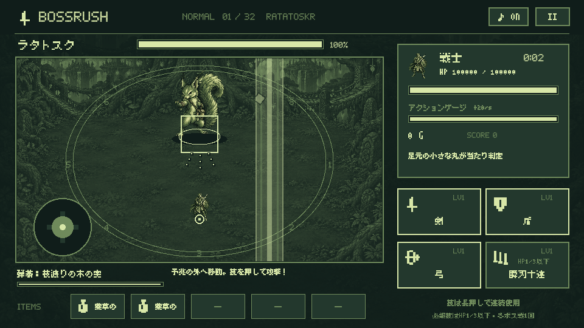
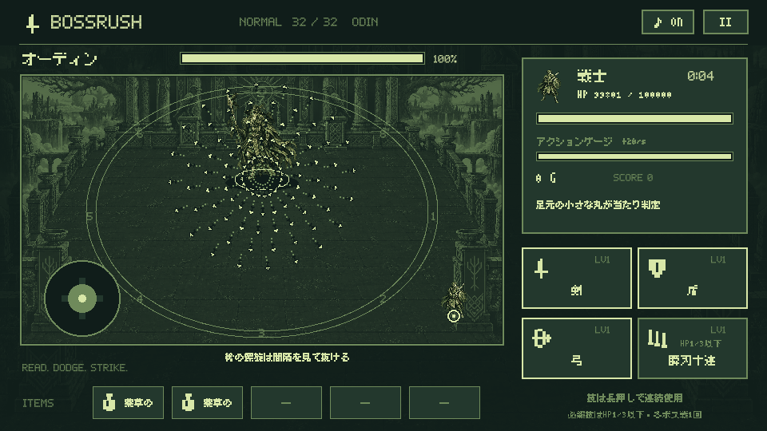

# BOSSRUSH 1.0.21 — 全32体の遠隔弾幕

## 遊び方と戦闘の流れ

各ボスの通常技の連続予兆が解決すると、ボスに光る四角と発射方向の点線が現れ、専用の弾幕を放ちます。弾本体に触れると被弾し、点線と短い残像には当たり判定がありません。弾幕中は新たな床攻撃を開始せず、弾が消えた後に次の通常技・必殺技の選択へ戻ります。HP1/2での必殺技は優先し、飛んでいる弾と発射待ちを消します。

発射位置と狙いは光が現れた時点で固定し、発射済みの弾は主人公を追尾しません。ムニンは通常技開始時の位置を記憶します。近接職も発射の光を見て横や外へ避け、弾と弾の間を抜けてください。

[全32体の弾幕一覧](screenshots/barrage-all-32.png)。一覧・上記画像は描画検証用に主人公のHPを増やした状態です。

## 32体の弾幕

| ボス | 弾幕 | 軌道 | 1波の弾数 × 波数 | 回避の手掛かり |
| --- | --- | --- | ---: | --- |
| ラタトスク | 枝渡りの木の実 | 扇 | 3 × 2 | 木の実の三方向射撃を横へかわす |
| ダーイン | 四枝の若葉 | 十字 | 8 × 2 | 四方へ広がる葉の間を抜ける |
| グリンブルスティ | 黄金の剛毛 | 矢列 | 4 × 3 | 並んで飛ぶ黄金の針から横へ |
| フギン | 思考の羽矢 | 扇 | 5 × 3 | 開いてゆく羽の扇を見て移動 |
| ムニン | 記憶の返し羽 | 左右対 | 6 × 3 | 最初にいた場所から切り返す |
| タングリスニ | 雷車の双轍 | 左右対 | 6 × 3 | 二列の雷針の間に入る |
| スコル | 追日の光輪 | 輪 | 10 × 2 | 外へ広がる日輪の隙間へ |
| ハティ | 追月の弧 | 扇 | 7 × 3 | 曲がる月の軌道の外へ |
| フレースヴェルグ | 北風の羽嵐 | 波 | 7 × 3 | うねる羽の列を大きく回避 |
| スィアチ | 奪春の氷羽 | 左右対 | 8 × 3 | 両翼から開く氷の羽を避ける |
| スカジ | 雪山の矢雨 | 矢列 | 5 × 4 | 細い矢列を左右にかわす |
| ウル | 狩神の連弓 | 十字 | 12 × 3 | 回転する矢の十字の間へ |
| エーギル | 海宴の波珠 | 波 | 9 × 4 | 速度の違う波の列を見分ける |
| ラーン | 溺者の結び網 | 十字 | 12 × 3 | 交差する網の結び目を避ける |
| ニョルズ | 順風の潮弾 | 扇 | 9 × 4 | 風に曲がる潮の扇をかわす |
| ヨルムンガンド | 世界蛇の毒環 | 輪 | 14 × 3 | うねる毒の輪の隙間へ |
| ガルム | 冥門の血牙 | 扇 | 9 × 3 | 三連の牙の扇から離れる |
| ヘル | 生死の魂環 | 輪 | 14 × 4 | 逆向きにずれる二つの魂環 |
| ニーズヘッグ | 根喰いの毒流 | 波 | 11 × 4 | 蛇行する毒の列を横に抜ける |
| フェンリル | 断鎖の散弾 | 螺旋 | 12 × 4 | 鎖の破片が螺旋に広がる |
| フルングニル | 石心の砥石花 | 花 | 15 × 3 | 三角の石心から広がる破片 |
| スリュム | 霜王の氷鎚 | 十字 | 16 × 4 | 回る氷の十字を斜めにかわす |
| ウートガルザロキ | 幻城の偽星 | 螺旋 | 13 × 4 | 曲がるルーンの螺旋を読む |
| スルト | 終末の火弾雨 | 扇 | 13 × 5 | 火の扇が順に向きを変える |
| イズン | 黄金林檎の種 | 花 | 16 × 4 | 花のように開く種の隙間へ |
| フレイ | 自律剣の輪舞 | 螺旋 | 14 × 5 | 回りながら広がる剣の輪 |
| フレイヤ | 黄金涙の花 | 花 | 18 × 4 | 波打つ涙の花をくぐり抜ける |
| テュール | 誓約の剣列 | 左右対 | 12 × 5 | 左右に開く剣列の切れ目へ |
| ヘイムダル | 虹橋の星鐘 | 輪 | 18 × 4 | 星の輪の間を乗り換える |
| ロキ | 変幻の火蛇 | 螺旋 | 15 × 5 | 逆巻く炎の螺旋を見てかわす |
| トール | 雷鎚の九連環 | 輪 | 18 × 5 | 雷鎚の放射と次の輪の間へ |
| オーディン | 槍と鴉の星陣 | 螺旋 | 20 × 5 | 槍の螺旋は間隔を見て抜ける |

## 判定とバランス

- 発射の合図は第1戦0.75秒から第32戦0.55秒。弾速は68から108へ増加し、各職業の基礎移動速度より低く設定します。一部の波・花の弾には速度差があります。
- 木の実・葉・牙・羽・針・太陽・月・結晶・雫・ルーン・鎖・炎・林檎・剣・鎚・槍の16種類をCanvasでドット描画。通常弾はゲームボーイ色、必殺技は既存のボス固有の鮮やかな色です。
- 被ダメージはボスの基礎攻撃力の55〜70%。盾・防御アイテムの軽減、無敵、はにわの身代わりを共通の処理で適用します。ハードモードでは基礎攻撃力が3倍になります。
- 足元の半径7と、弾の半径3.0〜3.8で判定します。生成直後0.2秒は半透明で無害。曲がる軌道を最大0.01秒刻みで進め、主人公との相対移動を使って接触を判定するため、フレーム間を通り抜ける高速弾にも対応します。
- 同時弾数は最大144、寿命は最大3.6秒。画面外へ出た弾も消去します。ポーズでは発射待ち・軌道・寿命が止まり、必殺技開始・ボス撃破・ゲームオーバー・タイトル帰還・次の戦闘で消去します。
- ボスHPと30秒の攻撃力基準、スコア計算、セーブの形式は変更しません。戦闘再開は従来どおりボス戦の開始前からです。

## 検証と実機

2026-09-14に確認。

- JVMテスト121件成功。32体の個別軌道、発射予告、移動と接触、フレーム間のすり抜け、初期の猶予、消去、ポーズ、ハード3倍、防御、無敵、はにわを確認。
- Android API 35エミュレーターで6項目成功。32体すべての描画、タップによるポーズと再開・カットイン・撃破、画面幅と左右の向き、ハード解放と保存、トップ10保存を確認。初回のエミュレーターSystem UI応答停止を復旧し、描画テストの主人公位置を弾の吸収と仮想スティックの重なりを避ける位置へ修正して再実行。
- `testDebugUnitTest lintDebug assembleDebug assembleRelease assembleDebugAndroidTest assemblePreview` の各タスク成功。Lintエラー0件、警告33件（新しい弾描画へのKTX利用提案1件を含む）。
- キャラクター39体・背景33枚・BGM34曲・物語32章と日本語715字のアセット検査成功。

## 実機向け開発版

実機にはGoogle Play署名の1.0.20が入っているため、アップロード鍵で署名したAPKを同じパッケージへ直接更新できません。配信版を保持し、`preview` ビルドで別アプリとして追加します。セーブとスコアはアプリごとに独立し、開発版は新規状態から開始します。

- アプリ名：BOSSRUSH 開発版
- パッケージ：`io.github.hatake716.bossrush.preview`
- バージョン：1.0.21-preview / code 22
- APK：`artifacts/delivery/barrage-1.0.21/BOSSRUSH-1.0.21-preview.apk`
- APK SHA-256：`e540f4b3bd2fdb84b8c9570ac7a20756aeba119005b2004fc27c7afe937bd669`
- 署名証明書 SHA-256：`4d17ecab52966f39c3cbc69f4bc6caa08a023a1342c29649e1b2cdc6c2167b0a`
- APKのZIP整合性、署名検証、16 KB zipalign検査成功。

同一の署名済み開発版APKをAPI 35エミュレーターで起動し、新規開始、物語スキップ、通常のHPでの弾幕描画、ポーズ・再開、プロセス終了後の「つづきから」をタップ操作で確認しました。

Pixel 10aへ別パッケージでインストールし、1.0.21-preview / code 22、Activity起動成功とプロセス、端末内APKのSHA-256一致を確認しました。配信版1.0.20はAPKのハッシュ、インストール日時・更新日時、インストーラーが追加前と一致しています。実機へのタッチやキー入力は行っていません。手持ちコントローラーでの弾幕プレイは未確認です。

実行ログ・署名・実機確認の記録はGit管理外の `artifacts/delivery/barrage-1.0.21/` に保存しています。
