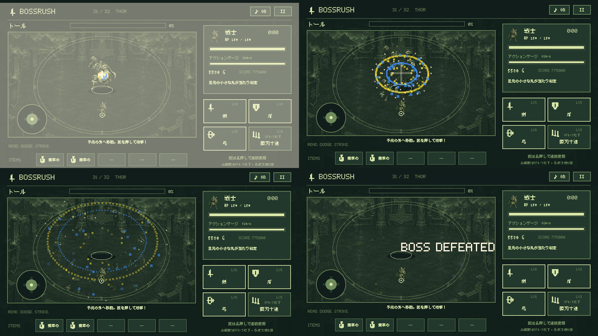
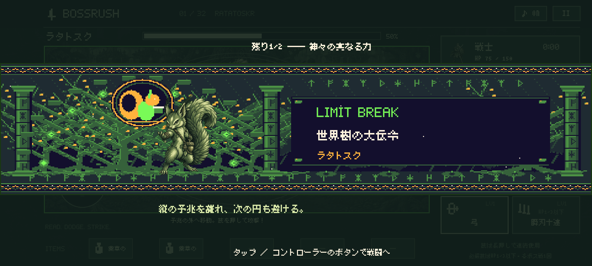
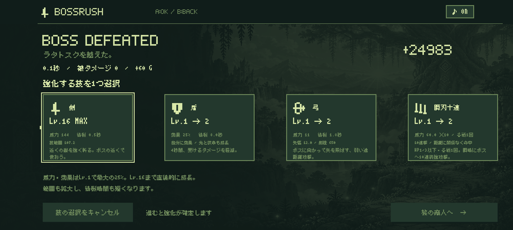

# BOSSRUSH 1.0.18 — カットイン操作と撃破演出

## 変更内容

- 強化画面に入るたびに、コントローラーのカーソルを左端の技に戻します。左端がLv.16でも位置は固定し、そのまま決定しても強化は行いません。カーソルと仮選択は別の状態で、開いた時点では未選択です。Bで取り消し、別の技への選び直し、次へ進む時点での確定を維持します。
- ボスの初回必殺技カットインは自動終了を廃止。新しい画面タップかコントローラーボタンの押下で閉じます。十字キー、左右トリガー、肩ボタン、START／SELECT、スティック押し込みにも対応します。スティックの傾き、表示前からの長押し、キーリピート、ボタンを離す操作では閉じません。Androidが処理するホームなどのシステムボタンは対象外です。
- カットインには操作案内を表示します。背後の操作ボタンをアクセシビリティの対象から外し、戦闘再開の操作だけを公開します。閉じるタップの残りのジェスチャーと、閉じるキーのリピートを消費し、攻撃やアイテム使用へ持ち越しません。
- カットインを待っている間は戦闘時間、HP、ゲージ、技の待機時間、強化の残り時間を停止します。アプリを中断しても、再開時にはカットインの待機へ戻ります。各戦闘でカットインを出すのは初回だけで、2回目以降の必殺技は従来どおり予兆から発動します。
- ボス撃破時に約1.8秒の専用画面を挟みます。本体の画像を48片へ分割した飛散、88本の火花、二重のドット状衝撃波、単発の閃光と減衰する画面揺れを描画します。32体それぞれの必殺技と同じ固有色を使用し、短い爆発SEも追加しました。世界の背景は従来の配色を維持します。
- 撃破演出中は残った予兆・弾・連撃と操作を停止します。撃破時の時間と被ダメージでスコアを確定し、金・スコア・撃破数の加算を1回だけ行います。演出終了後に強化画面へ進み、強化確定後の物語とショップへの進行は維持します。

## 演出の画面

トールの撃破演出を0.00秒、0.38秒、0.75秒、1.35秒で描いた検証用画面です。ボス撃破の状態をテストから用意したもので、プレイで31体を倒した記録ではありません。

カットインは操作案内を表示したまま入力を待ちます。強化画面の画像は左端をLv.16にした検証用状態で、カーソルが左端にあり、強化は未選択です。

## 実装

`GameEngine` に入力待ちの `awaitingCutin` と `dismissCutin()`、撃破演出用の `Screen.DEFEAT` を追加しました。演出中は通常の戦闘更新へ入りません。描画専用の `BossDefeatEffects` はスコア・ダメージ・報酬の状態を変更しません。

`GameController` は表示中の画面に対応するボタン群だけから初期カーソルを選びます。画面切り替え直後に前の画面のボタンを選択してしまうケースを防ぎ、強化画面では技番号0を優先します。物理的な押下状態は画面変更時の操作リセットと分けて保持します。

保存形式の変更はありません。強化確定前にアプリを終了して「つづきから」を選んだ場合は、従来どおりその戦闘の前から再開します。

## 検証

2026-09-10、versionName `1.0.18` / versionCode `19`。

- `testDebugUnitTest`：104件成功、失敗0。60秒待ってもカットインが残ること、停止・再開、32体の撃破演出中の無操作・無被弾・戦闘時計停止と報酬の重複防止を含みます。32戦の進行、必殺技、召喚の成長などの既存テストも成功。
- `lintDebug`：エラー0、警告31。既存のAndroid API・KTX等の警告を含みます。
- Debug APKとAndroidテストAPKのビルド成功。従来と同じDebug署名証明書を使い、APK署名と16 KB zipalignを確認。
- キャラクター39枚、背景33枚、音楽34曲、物語32章と715文字のフォントを既存のチェックツールで確認。
- API 35エミュレーター：関連15項目の最終結果が成功。修正後の入力7項目と全32体の描画1項目は、最終APKで再実行して **8件成功、97.583秒**。長押し・リピート・スティック、左右トリガー、キーと軸の二重通知、16種類のボタン、初期カーソルとLv.16の拒否、選択取消を検証。
- タッチ操作で最初のボスを倒し、カットイン解除→撃破演出→強化→ショップ→保存からの再開を確認。左右の横画面・カメラ穴・タブレット表示、撃破後の物語、最終ボス後のエピローグ、4職業の必殺技、BGMの画面切り替えとタイトルの無音も確認。
- 描画検査は半透明の火花と淡色のボス色を考慮し、元色に対する色相と彩度で判定。32体すべて成功し、トールの4時点とカットイン・初期カーソルの画像を目視確認。

物理コントローラー本体による機種別の操作確認は未実施です。コントローラー操作の検証はエミュレーターへAndroid入力イベントを送って行いました。

## APKと実機

- APK：`artifacts/delivery/battle-presentation-1.0.18/BOSSRUSH-1.0.18-debug.apk`（173,607,894 bytes）。
- SHA-256：`8d54458c88be844f7de54cb3232608e6d46cf4381700ed135ccd87262adf1224`。
- Debug署名の証明書SHA-256：`2c53b411c1193758289715cc230989564a571259b2eb4f5702b774c07a515e87`。
- Pixel 10aへ `adb install --no-incremental -r` で1.0.17から更新。アンインストール・データ初期化は行っていません。
- 端末のversionName/codeが1.0.18/19であり、インストールされたAPKのSHA-256が上記の検証済みAPKと一致することを確認。
- アプリのセーブデータ（719 bytes）は更新前後でSHA-256が一致。
- `MainActivity` が前面で再開され、アプリのプロセスが動作し、起動ログに `FATAL EXCEPTION` がないことを確認。
- 実機へのタップ・キー入力の自動注入は行っていません。実機での手動プレイによる操作感の確認は別です。

ログ・署名・ハッシュ・端末確認のJSONは、Git管理外の `artifacts/delivery/battle-presentation-1.0.18/` に保存しています。
