# 通常攻撃と覚醒後の戦闘 / 1.0.9

32体に合計66種類の専用通常攻撃を用意しています。判定には円・扇・帯などを使い、狙う位置、射線、同時配置、攻撃する順番をボスごとに定義しています。序盤は単発と短い二段、中盤は方向を変える二段、終盤は三〜四段の連撃を中心にしています。

## ボス自身の移動

1.0.9では32体すべてに移動する通常技を設定しました。突進、飛び込み、回り込み、瞬間移動を使い分け、攻撃の合間にも短く位置を変えます。移動は画面内の実際のボス座標に反映されるため、近接技の届く距離、矢・魔法の命中、召喚獣の追従も変わります。

- **突進**：進路を帯で予告してからボスが走ります。走行中のボス本体と接触したときだけ、1回の突進につき最大1回のダメージ判定を行います。帯には出発点・終点の体の幅も含みます。横へかわし、通過後を追いかけると攻撃できます。
- **飛び込み**：着地点の円を先に示し、ボスが跳んで、円の攻撃と同時に着地します。高さ、地面の影、残像を表示します。
- **回り込み**：弓使い・風や海の神々などが主人公との距離を取りつつ移動し、移動先に対応した予兆から攻撃します。
- **瞬間移動**：幻術・記憶・冥界の神々が出発点と移動先にルーンを出し、姿を薄くして位置を変えます。途中の直線上にいるだけで矢が命中することはありません。

移動先は予兆が出るときに固定し、その後は主人公に追尾させません。画面内の範囲に収め、壁際でほとんど動けない場合も別の移動先を予告します。ボスの絵の大きさではなく、地面の座標を基準に判定します。残像・土煙・移動先の四隅の目印は装飾です。

必殺技にも突進や跳躍・位置変更を組み込みます。予兆を延ばした場合は移動開始・着地も同じ時計に連動します。HP1/4以下では本体の移動は1経路だけにし、もう一つの技はそのボスの魔法・射線・範囲攻撃として同時に発動します。突進中は走行が完了してから次の段へ進みます。一時停止中は移動・予兆とも停止し、初回カットインへ入ると進行中の突進と予兆を取り消します。

| # | ボス | 移動方式 | 移動する通常技 |
| --- | --- | --- | --- |
| 01 | ラタトスク | 飛び込み | 木の実の雨 |
| 02 | ダーイン | 突進 | 角の薙ぎ払い |
| 03 | グリンブルスティ | 突進 | 黄金突進 |
| 04 | フギン | 回り込み | 思考の羽 |
| 05 | ムニン | 瞬間移動 | 記憶の追跡 |
| 06 | タングリスニ | 突進 | 角突き |
| 07 | スコル | 突進 | 陽炎の牙 |
| 08 | ハティ | 飛び込み | 夜の追跡 |
| 09 | フレースヴェルグ | 回り込み | 北風の翼 |
| 10 | スィアチ | 飛び込み | 鷲の急襲 |
| 11 | スカジ | 回り込み | 雪の矢列 |
| 12 | ウル | 回り込み | 交差する矢 |
| 13 | エーギル | 回り込み | 潮の宴 |
| 14 | ラーン | 瞬間移動 | 海底の網 |
| 15 | ニョルズ | 回り込み | 順風の試練 |
| 16 | ヨルムンガンド | 突進 | 毒の息 |
| 17 | ガルム | 突進 | 冥府の咆哮 |
| 18 | ヘル | 瞬間移動 | 生死の境 |
| 19 | ニーズヘッグ | 飛び込み | 根腐れの息 |
| 20 | フェンリル | 突進 | 双顎 |
| 21 | フルングニル | 飛び込み | 砥石砕き |
| 22 | スリュム | 飛び込み | 霜の大槌 |
| 23 | ウートガルザロキ | 瞬間移動 | 幻の試練 |
| 24 | スルト | 突進 | 炎剣の薙ぎ |
| 25 | イズン | 回り込み | 林檎の試練 |
| 26 | フレイ | 突進 | 鹿角の一撃 |
| 27 | フレイヤ | 飛び込み | 猫の追跡 |
| 28 | テュール | 突進 | 片腕の剣 |
| 29 | ヘイムダル | 回り込み | 虹橋の光線 |
| 30 | ロキ | 瞬間移動 | 変わり身 |
| 31 | トール | 飛び込み | ミョルニル |
| 32 | オーディン | 突進 | グングニル |

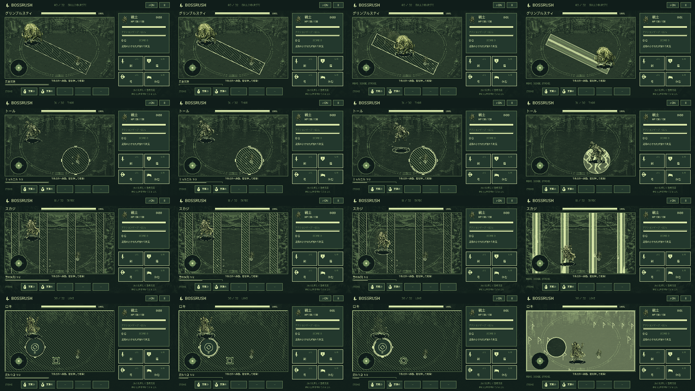

## 通常攻撃の個性

「過去の位置」は通常攻撃を始めた瞬間の主人公の位置です。「狙撃」「追跡」は各段の予兆が出るときに再照準し、その後は予兆を動かしません。前の段が終わってから次の予兆を出します。

| # | ボス | 通常攻撃と回避の手掛かり |
| --- | --- | --- |
| 01 | ラタトスク | 木の実の雨（1段）：足元を狙って跳び、着地の円で攻撃。円の外へ 枝渡り（2段）：枝を渡る順番に、縦の帯が走る |
| 02 | ダーイン | 角の薙ぎ払い（1段）：角を前に踏み込む突進。帯の横へかわす 落葉の輪（1段）：四枚の葉が落ちる。中心と葉の隙間へ |
| 03 | グリンブルスティ | 黄金突進（1段）：黄金の猪が直線を駆け抜ける。帯の横へかわす 光の牙（2段）：牙は外から内へ。次の扇も見直す |
| 04 | フギン | 思考の羽（1段）：回り込んでから、思考の羽が左右から足元を挟む 黒翼の交差（1段）：黒翼の斜めの交差。菱形の隙間へ |
| 05 | ムニン | 記憶の追跡（2段）：ルーンを残して瞬間移動し、記憶は最初にいた場所へ戻る 忘却の翼（2段）：最初の向きを記憶する翼。背面へ切り返す |
| 06 | タングリスニ | 蹄の雷（1段）：二つの蹄から雷の轍が走る 角突き（2段）：角を構えて突進し、最初の足元に雷を落とす |
| 07 | スコル | 陽炎の牙（2段）：太陽の牙で突進し、次に横向きの扇で追撃する 日輪狩り（2段）：日輪が外へ広がる。中心と外周を切り返す |
| 08 | ハティ | 月影の輪（2段）：月の輪が閉じた後、月の中心から離れる 夜の追跡（2段）：最初は飛び込み、続いて現在の足元へ噛みつく |
| 09 | フレースヴェルグ | 北風の翼（2段）：回り込んでから、北風の後に左右の風壁。中央へ戻る 風の裂け目（2段）：風の裂け目が斜めに交替する |
| 10 | スィアチ | 鷲の急襲（2段）：鷲が飛び込んだ後、最初の足元の両側へ氷の羽 凍てつく羽（2段）：凍る羽は外側、次に真ん中へ落ちる |
| 11 | スカジ | 雪の矢列（2段）：回り込んでから、雪の矢列が交替。横の隙間を乗り換える 狙撃（2段）：二度の狙撃。射線が決まってから横へ |
| 12 | ウル | 交差する矢（2段）：回り込んでから、交差する矢が回転する。斜めから十字へ 盾の射線（2段）：盾の前を薙ぎ、背後へ矢を返す |
| 13 | エーギル | 潮の宴（3段）：回り込んでから、宴の三つの波。上から下へ進む 渦潮（2段）：渦の中心が移る。次の渦へ泳ぐ |
| 14 | ラーン | 海底の網（2段）：ルーンを残して瞬間移動し、網は縦糸、横糸の順。隙間を渡る 溺れる輪（2段）：投げ網の輪が閉じ、内側を捕らえる |
| 15 | ニョルズ | 順風の試練（2段）：回り込んで順風を起こす。吹き飛ばしの後に港の印へ戻る 航路の潮（2段）：航路を挟む波が横、縦へ切り替わる |
| 16 | ヨルムンガンド | 世界蛇の環（2段）：蛇の環が締まり、頭の側へ毒が来る 毒の息（2段）：蛇が突進し、最初の足元へ三つの毒溜まりを残す |
| 17 | ガルム | 冥府の咆哮（3段）：突進、記憶した向きの背面、両脇の咆哮の順 血の足跡（3段）：血の足跡は三度追跡。止まると噛まれる |
| 18 | ヘル | 生死の境（3段）：ルーンを残して瞬間移動し、生と死の半面が交替し、最後は中央へ 冷たい抱擁（2段）：冷たい抱擁は外、内の順に閉じる |
| 19 | ニーズヘッグ | 根腐れの息（3段）：飛び込み、最初の足元の毒、逆向きの息の順 黒根の侵食（2段）：黒い根が格子状に伸び、次に根元が崩れる |
| 20 | フェンリル | 双顎（3段）：突進して背面を噛み、移動先の周囲の鎖を砕く 鎖の破片（2段）：鎖の交差を抜け、破片が広がる前に内へ |
| 21 | フルングニル | 砥石砕き（2段）：石の巨体で飛び込んだ後、戦場の中央が砕ける 石心の地割れ（3段）：三角の石心から三方向へ地割れが走る |
| 22 | スリュム | 霜の大槌（3段）：鎚を構えて飛び込み、斜めの十字、足元の氷砕きへ 氷壁（2段）：氷壁が左右から上下へ閉じる |
| 23 | ウートガルザロキ | 幻の試練（3段）：ルーンを残して瞬間移動し、幻の印は左、右、中央。印を見直す 虚像の手（3段）：虚像の手が前後を交換し、十字へ変わる |
| 24 | スルト | 炎剣の薙ぎ（3段）：炎剣を構えて突進し、半面の薙ぎと最後の斬線へ 火の雨（3段）：火の雨は三度。直前の落下地点も見る |
| 25 | イズン | 林檎の試練（3段）：回り込んでから、三つの林檎を順に守る。印の中へ 若葉の波紋（3段）：若葉の波紋は内、外、足元へ広がる |
| 26 | フレイ | 鹿角の一撃（3段）：鹿角を構えて突進し、扇の突きから光の剣を放つ 豊穣の光（3段）：自ら戦う光の剣が三度回転する |
| 27 | フレイヤ | 猫の追跡（3段）：猫のように跳んだ後、両側と現在の足元へ追撃 セイズの輪（3段）：首飾りの星が交差し、黄金の印へ集まる |
| 28 | テュール | 片腕の剣（3段）：剣を構えて突進し、記憶した向きの背面、細い突きへ 誓いの切先（3段）：誓いの切先をかわし、誓約の印を守る |
| 29 | ヘイムダル | 虹橋の光線（3段）：回り込んでから、虹橋の光線は三度交替。橋の隙間を渡る 角笛の波紋（3段）：角笛の波は内、外、上下の順に響く |
| 30 | ロキ | 変わり身（3段）：ルーンを残して瞬間移動し、変わり身は印、偽の足跡、反対側の印 策略の足跡（3段）：策略は今、過去、未来の足元へ向かう |
| 31 | トール | ミョルニル（3段）：雷鎚を振り上げて飛び込み、斜めの十字、落下地点を砕く 雷鳴（2段）：雷鳴の吹き飛ばしから、鎚の内側へ戻る 落雷（3段）：三連落雷。最後は隣にも雷が分かれる |
| 32 | オーディン | グングニル（4段）：槍を構えて突進し、向きを変えた射線と足元の円で追撃 二羽の鴉（3段）：思考の鴉は今を、記憶の鴉は過去を狙う ルーンの試練（3段）：ルーンを踏み、槍の格子を抜け、次の印へ |

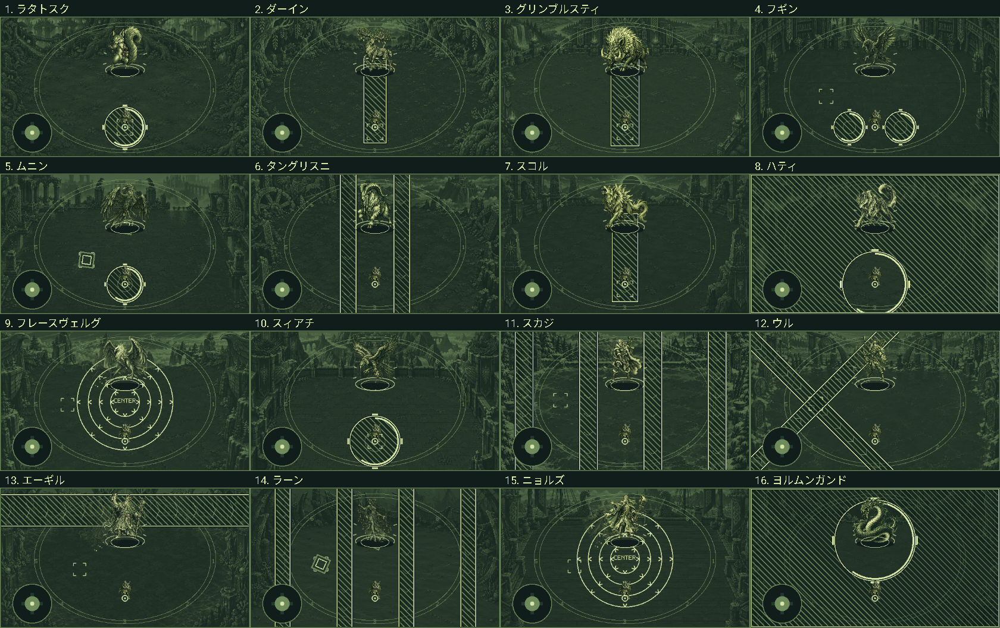

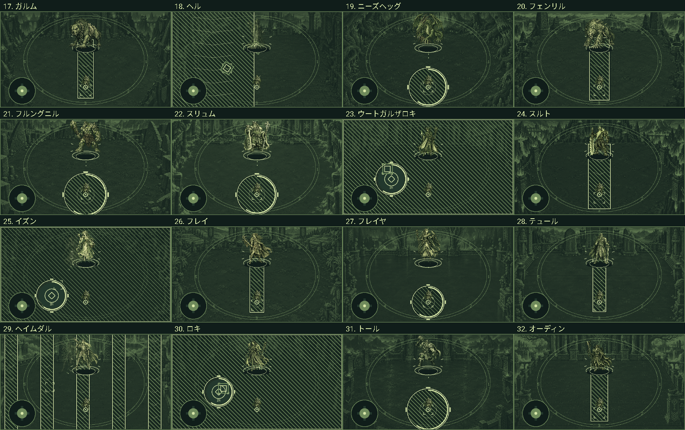

## 後半の難易度

ボス番号 `s` を0〜31、進行度 `t = s / 31` とします。

- 基礎攻撃力：`15 + 1.35 × s + 0.010 × s²`。
- 通常技の基準予兆：`(1.85 − 0.60 × t) × 0.5` 秒。
- 一つの通常技を終えた後の間隔：`(1.05 − 0.50 × t) × 0.5` 秒。
- 連撃中の段と段の間隔：`(0.65 − 0.30 × t) × 0.5` 秒。
- 必殺技の威力：基礎攻撃力の1.65倍。吹き飛ばしで外壁へぶつかった場合は、その技の威力の1.5倍。

| 戦闘 | 基礎攻撃力 | 基準予兆 | 技の後の間隔 |
| --- | ---: | ---: | ---: |
| 1体目 | 15.00 | 0.925秒 | 0.525秒 |
| 8体目 | 24.94 | 0.857秒 | 0.469秒 |
| 16体目 | 37.50 | 0.780秒 | 0.404秒 |
| 24体目 | 51.34 | 0.702秒 | 0.340秒 |
| 32体目 | 66.46 | 0.625秒 | 0.275秒 |

1.0.7では、初動待機（1.6→0.8秒）、基準予兆、技と段の間隔、必殺技の段間隔（2.2→1.1秒）、追撃の時間差、判定終了までの余白を0.5倍にしました。初回カットインの表示は3秒です。見えている予兆の外へ逃げる距離に応じた延長があるため、実戦の全発動時刻が一律に半分になるわけではありません。

4職業の基礎移動速度を1.2倍にしました。戦士132、魔法使い134.4、召喚士129.6、盗賊142.8（論理座標/秒）。斜め方向は正規化し、速度アイテムや職業の移動強化はこの基礎値に掛かります。

予兆が出た時点の位置から、未強化の職業で共通の安全地点へ移動できる時間を計算します。必要な場合は基準予兆を延ばし、通常技は序盤0.275秒〜終盤0.150秒、必殺技は0.20秒の反応猶予を確保します。吹き飛ばしは外壁と、着地先に重なる別の技も確認します。技の後の間隔は、予兆と判定の終了後から数えます。

通常攻撃の名前と回避のヒントを戦闘中に表示し、ボス紹介にも通常技の名前と覚醒後の動作を記載します。

## HP1/2からのランダムな攻撃

初めてHPが1/2に達したときは、3秒のカットインを必ず挟んで必殺技へ移行します。大ダメージでこの初回演出を飛ばすことはできません。途中だった通常技の連撃と予兆は取り消します。

その後は通常攻撃を1〜3回挟み、必殺技をランダムに再使用します。通常技を1回使った後の各選択では、序盤22%〜最終戦40%の確率で必殺技を選びます。通常技が3回続いた場合は次を必殺技にし、必殺技同士は連続させません。覚醒後の通常技は直前と違う技からランダムに選びます。覚醒前は固有技を順番に使います。

カットインは各戦闘の初回の1回だけです。2回目以降はカットイン画面へ切り替えず、その場で必殺技の予兆を開始します。戦闘時計・移動・技の長押しは継続します。HP1/4より多い間は、必殺技の連続攻撃が終わるまで次の通常技を重ねません。一時停止ではカットイン、次の連撃までの待機、戦闘時計を止めます。ボスを倒せば、その時点で勝利になります。

## HP1/4以下の二重詠唱

HPが最大値の25%以下になると、次の予兆から通常技の各段に**別の固有通常技の一撃**を重ねます。必殺技でも、各段へそのボス自身の通常技の一撃を追加します。二つの技は同じ時刻に予兆を開始し、通常は同時に攻撃判定が発生します。突進を重ねる場合は、追加する範囲攻撃の発動と同時に本体が走り出し、接触時に突進の判定を行います。主となる技の連撃は継続し、重ねる側はその技の段から一撃を選びます。

二つの攻撃に共通の退避場所がある組み合わせを選びます。「内側へ入る」と「その内側すべてを埋める」などの矛盾がある場合は、別の段・左右の配置を選び、必要なら追加する側の配置を点対称にします。選んだ配置は予兆で示され、発動まで固定されます。共通の安全地点が遠ければ、両方の予兆を同じだけ延ばします。

戦闘中は「二重詠唱」と重なる技を表示します。覚醒後のランダム選択と初回だけのカットインを維持します。

## 鮮やかな必殺技

通常攻撃と世界の背景はゲームボーイ風の配色です。必殺技の予兆・詠唱・発動・カットインには、全32体それぞれの2色の組み合わせを使います。カットイン背景は480×132のドット絵をコードで手描きしています。世界樹、九つの世界を表す光、石柱、組紐、装飾ルーン、地域ごとの景色を描き、紋章を32体で作り分けました。鹿の角、太陽・月、羽、船、蛇、鎖、林檎、鎚などを使用。輪郭は整数座標で描き、7〜12色の限定パレットを最近傍で拡大します。主色・副色はそのボスの攻撃と同じ色です。装飾は創作であり、実在の碑文を写したものではありません。

トールは黄と青の稲妻、スルトは赤と金の炎、エーギルは水色と青の波、ヘルは水色と鮮やかな桃色の対比、オーディンは紫と青緑のルーンです。光柱、二重の光線、輪状の光、属性ごとの破片を重ね、必殺技の残光は1.05秒に延ばしました。

発動エフェクトはその技の危険範囲内へ描画し、ルーンや月印の安全な中心を塗りつぶしません。次の予兆と主人公・足元の当たり判定は残光より手前に描きます。残光だけで追加ダメージは発生しません。必殺技の一時的な色と、全32体撃破後に世界全体へ色が戻るエンディングを区別しています。

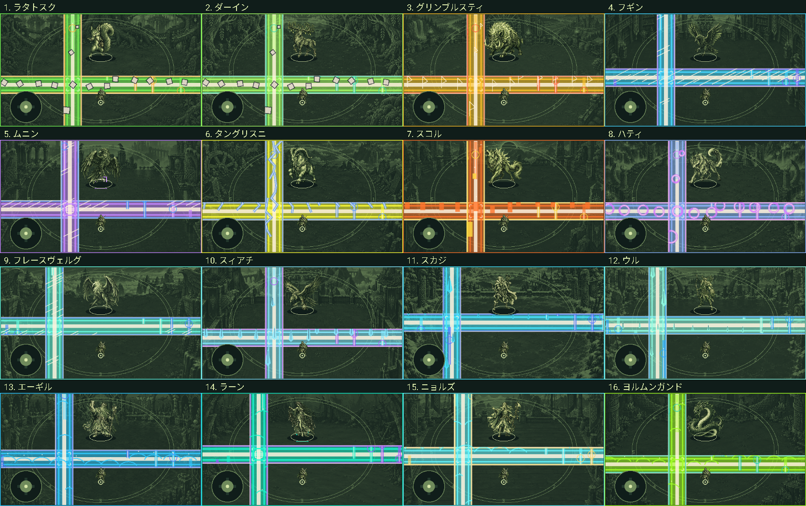

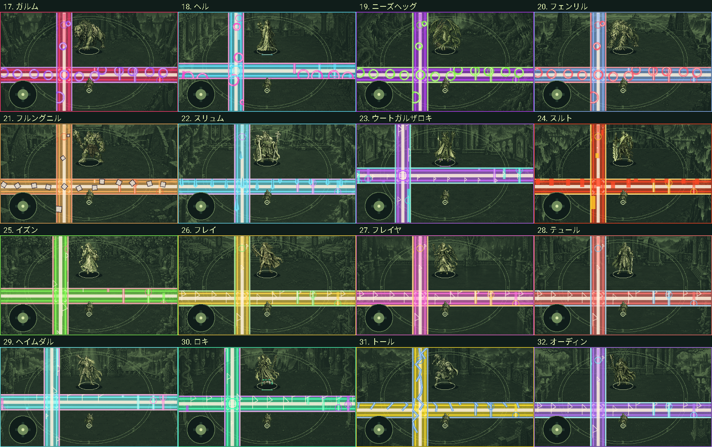

実際の描画例：[トールの発動](screenshots/ultimate-thor.png)、[ヘルの発動](screenshots/ultimate-hel.png)、[スルトのカットイン](screenshots/color-cutin-surtr.png)、[オーディンのカットイン](screenshots/color-cutin-odin.png)。いずれもテスト用の状態から取得しています。

1.0.7のドット絵カットイン背景の比較。各ボスの攻撃色と神話のモチーフを使っています。

| ラタトスク：緑 | エーギル：青 | ヘル：氷青 |
|---|---|---|
| 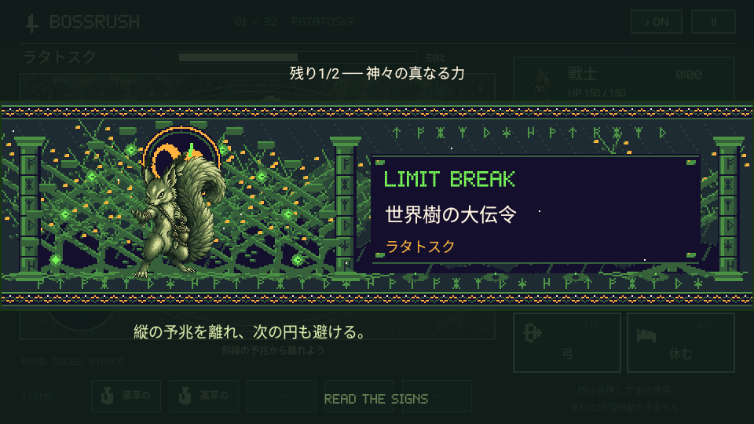 | 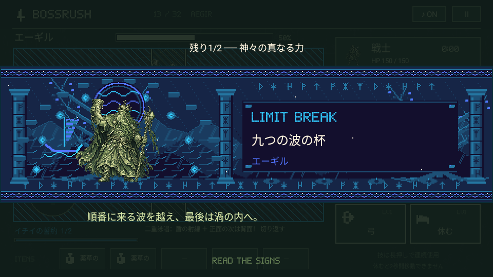 | 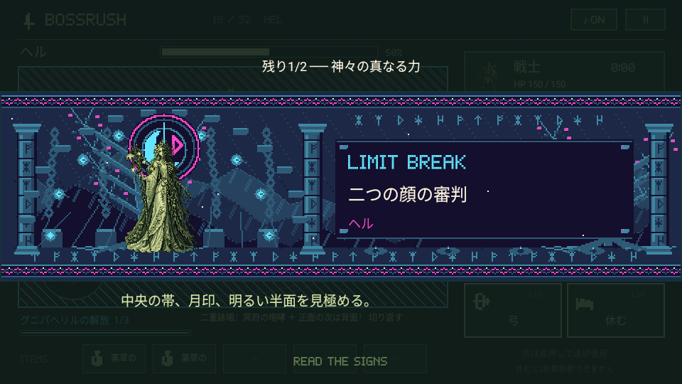 |

| スルト：炎の赤 | トール：雷の黄 | オーディン：紫 |
|---|---|---|
| 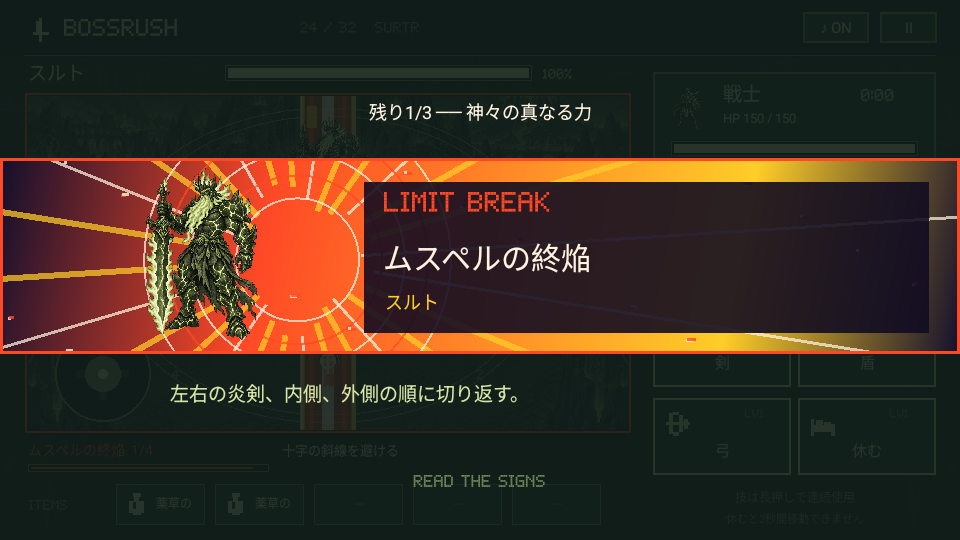 | 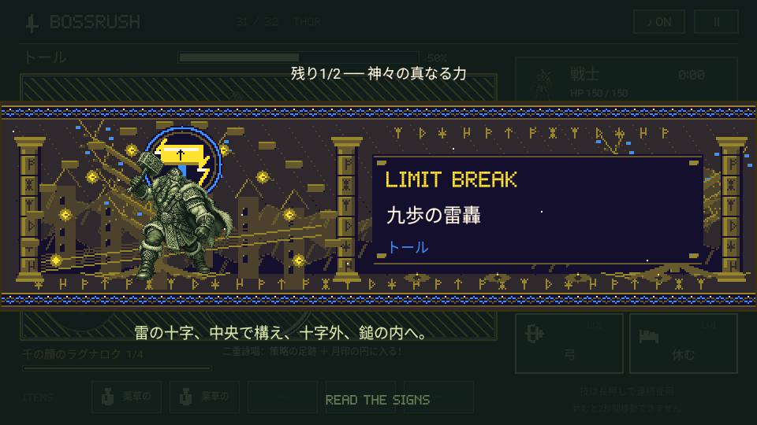 | 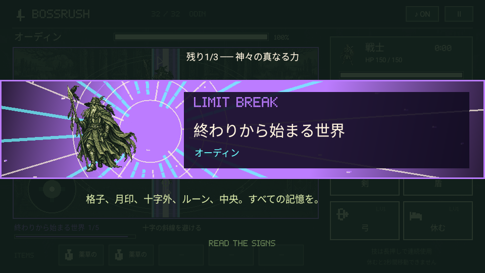 |

## 実装と検証

- `BossCombat.kt`：66種類の通常技、各段の照準、進行に応じた難易度、覚醒後の攻撃選択。
- `GameEngine.kt`：通常連撃の待機、初回・再使用の必殺技、安全地点までの到達時間。
- `UltimateColors.kt`：32体の必殺技の配色。
- `BattleEffects.kt`：色付き予兆・残光。`MythicCutin.kt`：32体のドット絵カットイン。
- `BossCombatTest`：全ボスの固有形状、安全地点、四隅からの移動猶予、記憶と狙撃の違い、乱数を固定した戦闘の再現、必殺技の再使用と一時停止。
- `BossCombatRenderTest`：全32体の鮮やかな発色と通常色、全66通常技、足元の可読性、安全な中心、カットインの描画。

画像はAndroidのゲーム描画処理へテスト用の状態を設定して撮影しています。32連戦を人が通して遊んだ記録ではありません。検証結果と実機への反映は [VALIDATION.md](VALIDATION.md) に記録します。

二重詠唱の描画例：[トール](screenshots/double-cast-thor.png)、[オーディン](screenshots/double-cast-odin.png)。[カットイン前半16体](screenshots/mythic-cutins-1.png)、[後半16体](screenshots/mythic-cutins-2.png)。いずれも描画検証用の状態です。
