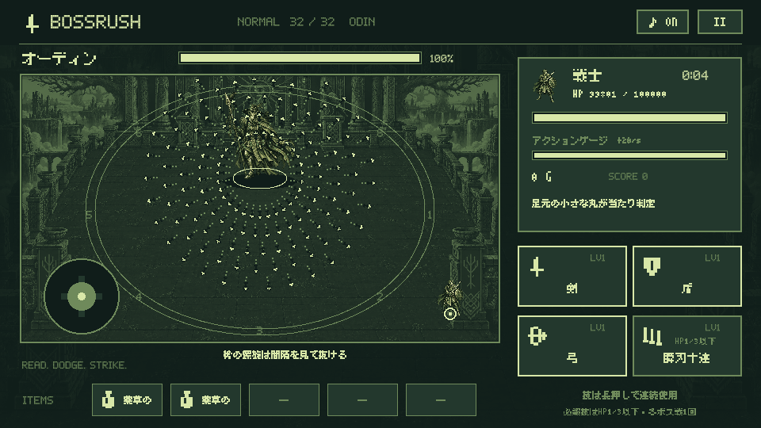

# BOSSRUSH 1.0.22 — 移動・攻撃速度と弾幕の調整

2026-09-16。比較対象は正式版1.0.21（versionCode 22）。更新版は1.0.22（versionCode 23）。

## 変更内容

プレイヤー4職の基礎移動速度とボスの攻撃速度を1.25倍にしました。頻度1.25倍に対応する待機時間は、旧値を1.25で割った80%です。

| 職業 | 旧移動速度 | 新移動速度 |
| --- | ---: | ---: |
| 戦士 | 132.0 | 165.0 |
| 魔法使い | 134.4 | 168.0 |
| 召喚士 | 129.6 | 162.0 |
| 盗賊 | 142.8 | 178.5 |

単位は戦場の論理座標/秒。斜め移動も正規化し、タッチ・コントローラーの両方に同じ基礎速度を適用します。移動強化は新しい基礎速度に掛け合わせます。

| ボスの挙動 | 変更 |
| --- | --- |
| 通常技・必殺技の発動待ち、連続技の間隔、技後の待機 | 旧値の80% |
| 突進・跳躍・回り込み・瞬間移動の所要時間 | 旧値の80% |
| 攻撃の合間の移動速度 | 1.25倍 |
| 弾速 | 68〜108 → 85〜135 |
| 弾幕の予告 | 0.75〜0.55秒 → 0.60〜0.44秒 |
| 弾の連射間隔、寿命、初期の無害時間 | 旧値の80%（寿命2.88秒、無害時間0.16秒） |
| 曲がる弾・波打つ弾 | 曲がる速さも1.25倍、進む距離に対する形を維持 |

遠い安全地帯への到達時間に合わせて床攻撃の予告を延長する既存の処理にも、新しい移動速度を使用します。実際の発動間隔は安全地帯・被弾による弾の消滅・ボスの攻撃選択によって変わります。設定された待機時間を80%にする調整であり、全状況の実測攻撃回数が必ず1.25倍になるという意味ではありません。

## 弾幕の難度

弾の密度を増やすため、1波あたりの弾数に序盤1.35、中盤1.45、終盤1.55を掛けて切り上げます。左右対は偶数、十字は4の倍数へ揃えます。連射の波数は維持して、攻撃のサイクルを長引かせずに難しくします。

奇数番目の追加波は発射角をずらすため、同じ隙間で待ち続けにくくなります。弾の見た目・各ボス固有の軌道・神話のモチーフは維持。ボスの予告が始まる時点で狙いを固定し、発射済みの弾は追尾しません。発射方向の点線は新しい弾数に対応します。

同時弾数の上限は144から192へ変更。全ボスの1回の弾幕が上限内に収まります。弾本体の当たり判定サイズ、1発のダメージ倍率、被弾後の無敵時間は従来どおりです。ハードのダメージ・スコア3倍、盾、防御アイテム、はにわ、透明化にも既存の処理を適用します。

| ボス | 旧弾数/波 | 新弾数/波 | 波数 | 新合計 |
| --- | ---: | ---: | ---: | ---: |
| ラタトスク | 3 | 5 | 2 | 10 |
| ダーイン | 8 | 12 | 2 | 24 |
| グリンブルスティ | 4 | 6 | 3 | 18 |
| フギン | 5 | 7 | 3 | 21 |
| ムニン | 6 | 10 | 3 | 30 |
| タングリスニ | 6 | 10 | 3 | 30 |
| スコル | 10 | 14 | 2 | 28 |
| ハティ | 7 | 10 | 3 | 30 |
| フレースヴェルグ | 7 | 11 | 3 | 33 |
| スィアチ | 8 | 12 | 3 | 36 |
| スカジ | 5 | 8 | 4 | 32 |
| ウル | 12 | 20 | 3 | 60 |
| エーギル | 9 | 14 | 4 | 56 |
| ラーン | 12 | 20 | 3 | 60 |
| ニョルズ | 9 | 14 | 4 | 56 |
| ヨルムンガンド | 14 | 21 | 3 | 63 |
| ガルム | 9 | 14 | 3 | 42 |
| ヘル | 14 | 21 | 4 | 84 |
| ニーズヘッグ | 11 | 16 | 4 | 64 |
| フェンリル | 12 | 18 | 4 | 72 |
| フルングニル | 15 | 24 | 3 | 72 |
| スリュム | 16 | 28 | 4 | 112 |
| ウートガルザロキ | 13 | 21 | 4 | 84 |
| スルト | 13 | 21 | 5 | 105 |
| イズン | 16 | 25 | 4 | 100 |
| フレイ | 14 | 22 | 5 | 110 |
| フレイヤ | 18 | 28 | 4 | 112 |
| テュール | 12 | 20 | 5 | 100 |
| ヘイムダル | 18 | 28 | 4 | 112 |
| ロキ | 15 | 24 | 5 | 120 |
| トール | 18 | 28 | 5 | 140 |
| オーディン | 20 | 31 | 5 | 155 |

## データ互換性と配布

パッケージ名は `io.github.hatake716.bossrush`。正式版1.0.21と同じアップロード鍵を使用します。セーブとハイスコアの保存形式は変更せず、既存の職業・技レベル・ストーリー・ハード解放状態を読み込みます。

プレイヤーの攻撃力、技の待機時間、召喚や強化アイテムの効果時間、ボスHPの30秒ダメージ基準、スコア計算式は変更していません。カットインは従来どおり入力するまで停止します。

Google Play用AAB・リリースノート・検証結果は `play/release/1.0.22/` に用意します。公開用の変更内容は [日本語リリースノート](../play/listing/release-notes-1.0.22-ja-JP.txt) を参照してください。

## 検証

- JVMテスト124件成功。移動倍率、斜め移動、全32体の移動時間と弾幕サイクル、密度、接触、難度、30秒ダメージ基準、セーブ互換性を確認。
- 全32体の弾幕で、最も遅い召喚士がボスから50離れた位置から予告と同時に移動するシミュレーションを実施。48方向の候補のうち無被弾で終わる経路が各ボスに少なくとも1つ存在。これは固定した初期配置での確認であり、任意の戦況からの回避保証ではありません。
- Android API 35エミュレーターの操作・描画テスト6件成功。全32体の弾幕、ポーズ、カットイン、コントローラー入力、ハード解放・保存、トップ10保存を確認。
- 署名済みの旧1.0.21と新1.0.22のAABからそれぞれAPKを生成。エミュレーターで旧版の序章2ページ目に保存し、新版をデータを消さず更新。ページ・本文の一致、戦闘開始、移動、弾幕、ポーズ・再開、プロセス再起動後の再開を確認。
- `testDebugUnitTest lintDebug assembleDebug assembleDebugAndroidTest bundleRelease` 成功。Lintはエラー0件・警告33件。AAB構造・署名、AABから生成したAPKの署名・16 KB zipalign検査成功。
- アセット検査：キャラクター39体・背景33枚・BGM34曲・物語32章と日本語715字を確認。
- 詳細ログと画面画像はGit管理外の `artifacts/delivery/tempo-1.0.22/` と `artifacts/delivery/play-1.0.22/` に保存。

今回は公開用データとドキュメントの作成までです。Google Playへのアップロード・審査提出・公開は行っていません。実機への追加インストールは行わず、更新操作はエミュレーターで検証しました。
