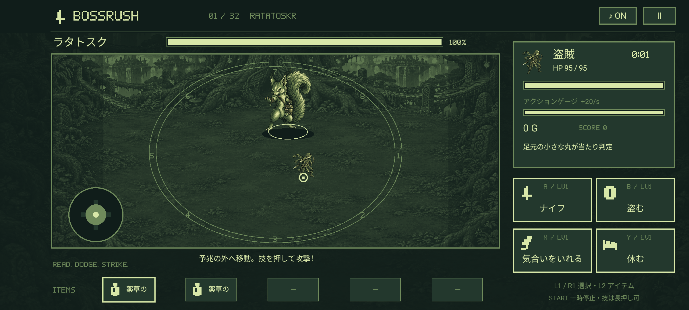
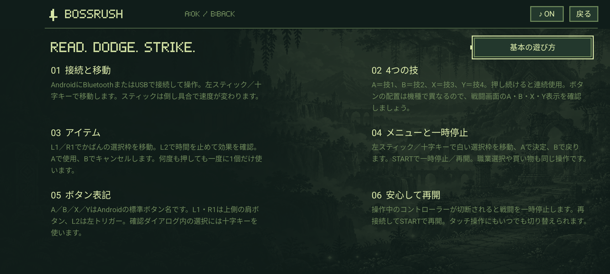

# 外部コントローラー / 1.0.6

AndroidにBluetoothまたはUSBでコントローラーを接続して使います。アプリはAndroid標準の `KeyEvent` / `MotionEvent` を受け取ります。接続そのものはAndroid側で行ってください。ボタンを押すと選択枠と操作表示が現れ、タッチ操作へも切り替えられます。

## 戦闘中

| 操作 | 動作 |
|---|---|
| 左スティック | 移動。倒し具合に応じて速度が変わる |
| 十字キー | 移動。上下左右と斜めに対応 |
| A / B / X / Y | 技1 / 技2 / 技3 / 技4。長押しで連続使用 |
| L1 / R1 | かばんの前 / 次のアイテムを選択 |
| L2（左トリガー） | 選択中アイテムの効果を確認して一時停止 |
| START | 一時停止 / 再開 |

技の表示は画面の左上から右へ **A・B、X・Y** の順です。戦士ならA＝剣、B＝盾、X＝弓、Y＝休むになります。

アイテム確認画面ではAで「使う」、Bでキャンセルします。L2を押しっぱなしでも確認画面を繰り返し開かず、Aを押しっぱなしでもアイテムを続けて使いません。空きスロットは飛ばして選択し、所持品がないと確認画面を開きません。

## メニュー

左スティック／十字キーで白い選択枠を動かし、Aで決定、Bで戻ります。職業選択、ボス紹介、強化、盗賊の戦利品、ショップ、図鑑、遊び方に対応します。無効な選択肢は飛ばします。必須の強化・戦利品を選び終わるまでは先へ進めません。

Androidの確認ダイアログ（新規冒険、アイテムを手放す）では十字キーで選び、Aで決定、Bで閉じます。最初の選択は「戻る」です。ダイアログ内では十字キーを使用してください。

ボタン名はAndroid標準のA・B・X・Yです。機種により印字や配置が違います。L1・R1は上側の肩ボタン、L2は左トリガーです。独自のキー割り当て設定はありません。

スティックの中心付近は機器のデッドゾーンを考慮し、微小な入力で勝手に移動しないようにしています。操作していたコントローラーの切断をAndroidが通知すると戦闘を一時停止し、移動と技の長押しを解除します。再接続後にSTARTで再開できます。

ゲーム内の「遊び方」→「コントローラー操作」でも一覧を確認できます。

## キーボードとタッチ

WASD／矢印キーで移動、1〜4で技、Escで一時停止・戻る。メニューはWASD／矢印キーで選択し、Enterで決定します。画面上のタッチスティック、技の長押し、アイテム選択も使えます。移動と攻撃を同時に行えます。

## 検証方法

`ControllerMathTest` はスティックの微小入力・速度・斜め方向と、メニューの方向選択を検証します。`ControllerTest` はエミュレーターのAndroid入力システムへゲームパッドのキー・軸イベントを送り、画面遷移、移動、4職業の全技、アイテム、確認ダイアログ、切断処理を検証します。一部の戦闘・報酬・ショップは明示したテスト用状態から開始します。

物理コントローラー機種ごとのBluetooth／USB接続とプレイ確認は未実施です。検証結果は [VALIDATION.md](VALIDATION.md) に記録します。

入力仕様の参照：[Android公式・コントローラー入力](https://developer.android.com/games/sdk/game-controller/controller-input)。
