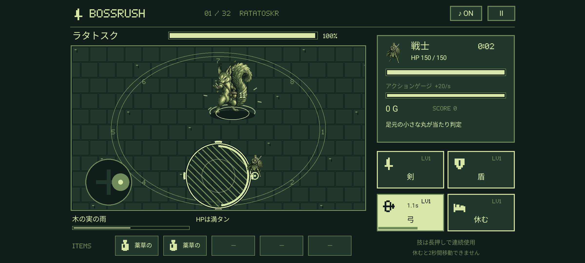
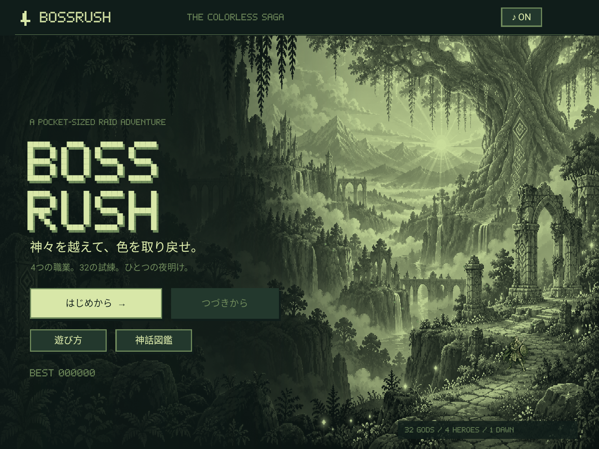
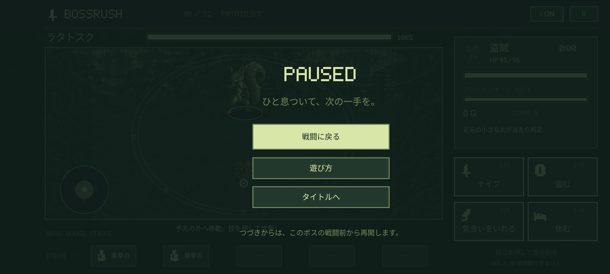
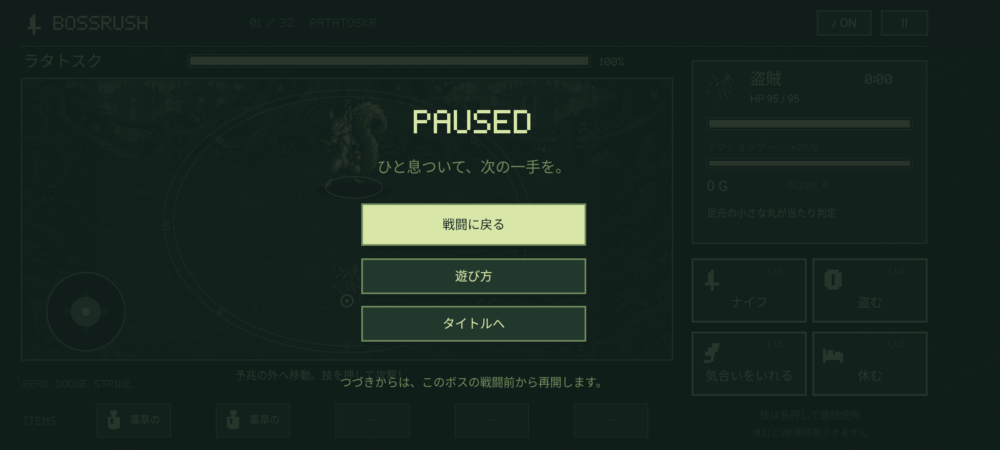

# 画面全体への表示 / 1.0.4

以前は960×540の画面を縦横比を保って中央に収めていたため、2400×1080の横長端末では左右に各240pxの未使用の帯が残っていました。1.0.4では背景を画面の両端まで描き、操作パネルも安全な横幅に合わせて配置します。

## 背景と操作領域

タイトル、エンディング、戦場の背景は原画全体を表示枠へ広げます。背景だけは縦横の倍率を枠に合わせます。キャラクター、文字、アイコン、戦闘の円や予兆には共通の縦横倍率を使用します。

右側の技パネルと戻るボタンは右端へ、職業・強化・商品カードは横幅全体へ配置します。ボス紹介の画像枠は広くなり、カットインと一時停止画面は新しい幅の中央に置きます。図鑑の右パネルと拡大表示の操作も画面幅へ追従します。

戦場の背景と外枠は広く表示します。600×334の戦闘判定領域はその中央に配置し、周囲を少し暗くしています。周囲の背景は装飾領域です。ボスの攻撃範囲、主人公の移動距離・速度、攻撃が届く距離は変更していません。

## カメラ穴と入力

Android 9以降では、カメラ穴のある領域にも背景を描画できるウィンドウ設定を使用します。ボタンや文字は `WindowInsetsCompat` のカメラ穴の安全領域を避けて配置します。Android 8ではその専用設定を使わず、通常の全面表示を使用します。

`GameViewport` が画面幅、安全領域、共通倍率、入力の原点を計算します。タッチ、複数指の移動と攻撃、TalkBackのボタン領域、ホバーは同じ座標系を使用します。画面サイズやカメラ穴の位置が変わると、表示と入力を更新します。

## 検証

`GameViewportTest` は画面端、カメラ穴の左右、共通倍率、入力座標の往復変換、タブレット表示を確認します。`FullscreenTest` は次の表示枠で全画面のボタンが収まること、タイトル・戦闘・エンディングの両端に背景が描かれること、足元マーカーが戦闘位置に重なることを検査します。

| 表示枠 | 安全領域の設定 |
| --- | --- |
| 1920×1080 | 16:9、カメラ穴なし |
| 2400×1080 | 横長、カメラ穴なし |
| 2424×1080 | 左96pxを保護 |
| 2424×1080 | 右96pxを保護 |
| 1600×1200 | 4:3のタブレット |

これらはAndroid Canvas上に設定した描画確認用の枠です。別の実操作テストでActivityを左右の横向きへ指定し、実際の回転角度が90度・270度で、カメラ穴の安全領域も左右へ移ったことを検査します。そのうえで、音の切り替え、遊び方から戻る操作、右端の盗賊選択、戦闘開始、一時停止、タイトルへの復帰を確認します。戦闘・買い物・再開などの既存テストも新しい配置で実行します。

検証結果、実機への反映、インストールしたAPKは [VALIDATION.md](VALIDATION.md) に記録します。

## 更新後の画面

横長エミュレーターで操作した戦闘画面。カメラ穴の安全領域を避けて左側の文字・スティックを配置し、背景はその背後にも描きます。

1600×1200のCanvas描画によるタブレット比率の確認用画面です。

左右の横向きで取得したエミュレーターの画面です。カメラ穴の位置に合わせて操作パネルの左右の余白が変わります。

