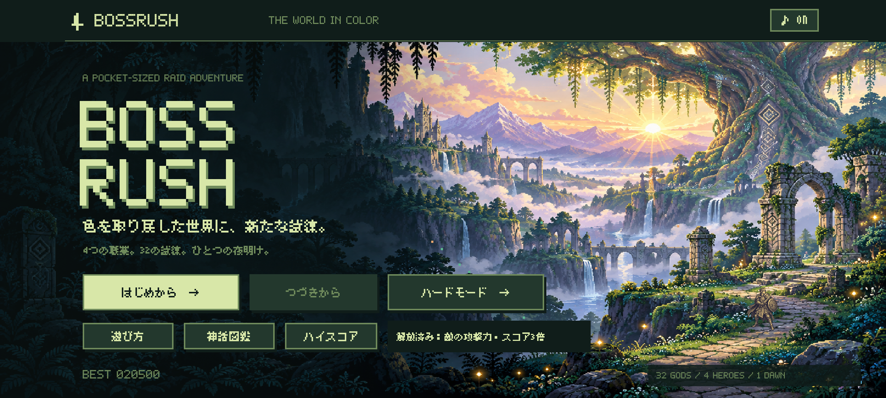
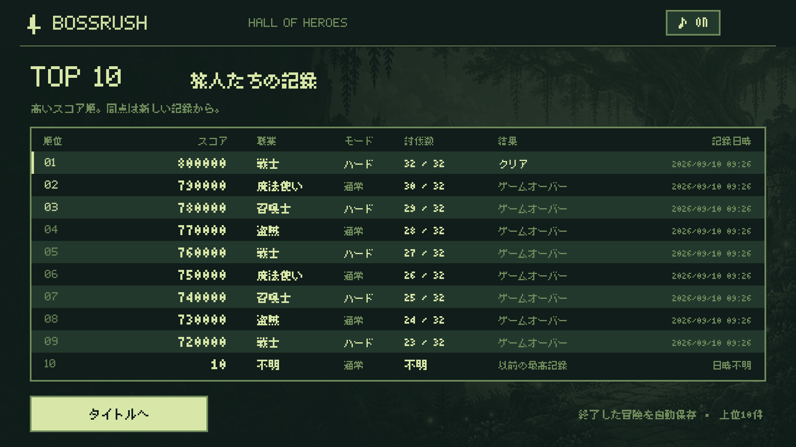

# BOSSRUSH 1.0.20 — 通常クリア後のハードモード

## 解放と操作

通常モードで32体のボスを倒し、終章を読み終える（またはスキップする）とクリアが確定し、タイトル背景がカラーになります。同時にスタートメニューに「ハードモード」が追加されます。途中のボス撃破やゲームオーバーでは解放しません。ハードモードのクリアだけでは通常クリアの解放条件を満たしません。

「はじめから」は通常モード、「ハードモード」はハードモードの新しい冒険です。どちらも職業を選んで序章から出発します。「つづきから」はセーブした難易度で再開し、ゲームオーバー後の「もう一度挑む」も同じ難易度です。保存済みの冒険がある場合は既存の確認ダイアログを使い、キャンセルしても保存内容や難易度を変更しません。タイトルBGMは無音を維持します。

画像はエミュレーターのクリア検証用データです。

## 倍率

| 項目 | 通常 | ハード |
| --- | ---: | ---: |
| ボスの基礎攻撃力 | 1倍 | 3倍 |
| ボス撃破スコア | 1倍 | 3倍 |
| ゲームオーバー時の未撃破ボスの途中経過点 | 1倍 | 3倍 |

通常攻撃・必殺技・突進接触・吹き飛ばしで外壁へ当たるダメージを、共通の基礎攻撃力から算出します。防御アイテムと盾の軽減はその後に適用します。無敵・透明化、はにわの身代わり回数は通常どおりです。ボスHP・技の間隔と予兆・主人公の攻撃力や成長・獲得金は変更しません。

スコアは従来の時間・被ダメージによる計算結果（整数）を3倍にし、獲得時に1回だけ加算します。保存済みの合計点を後から再び3倍にはしません。同じ討伐時間・同じ被ダメージなら通常20,500点に対してハード61,500点になります（例：30秒、被ダメージ0）。

## 保存と既存版の移行

- 冒険の保存形式をversion 3とし、`mode`（NORMAL／HARD）を保存。version 1・2の既存の冒険は通常モードとして読み込みます。
- ハイスコアはversion 2でモードを保存。version 1の過去記録は通常モードとして引き継ぎ、スコアの数値は変更しません。両モード共通で上位10件を保持し、一覧にモード列を追加します。
- `normalCleared` をクリア確定時の結果保存と同時に書き込みます。旧版の `clears` が1以上なら既に通常クリア済みとして扱います。既存の最高値だけでは解放しません。
- 新しい冒険やハードでのゲームオーバーによって解放を失うことはありません。端末内保存です。

上のランキングはレイアウト検証用の記録です。

## 検証

2026-09-10、versionName `1.0.20` / versionCode `21`。

- `testDebugUnitTest`：114件成功、失敗0。追加6件で32体の基礎攻撃力、4職業のHP・攻撃力、通常技・必殺技・突進・吹き飛ばし、軽減・無敵・はにわ、獲得スコアの一度だけの3倍補正、難易度の継続を確認。
- `lintDebug`：エラー0、警告32。Debug APK／AndroidテストAPKのビルドと物語・フォント検査が成功。
- API 35エミュレーター：関連12項目の最終結果が成功。通常未クリア時のロック、通常クリア時のカラー化と解放、コントローラーでのハード開始、旧クリア記録からの解放、確認ダイアログのキャンセル、通常とハード両方の保存・ランキングを確認。
- テスト用の新規冒険初期化と方向キーの手順を調整し、対象2件を再実行して成功（22.061秒）。アプリ本体の変更は不要でした。
- アプリを強制終了して新しいプロセスで起動した後も、ハードモードのボタン表示とハードの冒険の「つづきから」を確認。全保存値が変わらないことを確認。
- 1920×1080・2400×1080・左右カメラ穴付き2424×1080・1600×1200、横画面の両向きでボタンが画面内に収まることを確認。カラータイトル・解放メッセージ・ハードのボス紹介・モード付きの10件一覧を目視確認。

## APKと実機

- APK：`artifacts/delivery/hard-mode-1.0.20/BOSSRUSH-1.0.20-debug.apk`（173,355,713 bytes）。
- SHA-256：`9e1774a2eb1f0e4a662c225608c836ccfc09e30c052487892f3c7ce754e133dd`。
- Debug署名の証明書SHA-256：`2c53b411c1193758289715cc230989564a571259b2eb4f5702b774c07a515e87`。従来と一致。署名検証・16 KB zipalign検査も成功。
- Pixel 10aへ更新インストール成功。端末内APKのSHA-256がエミュレーター検証済みAPKと一致し、versionName `1.0.20` / versionCode `21`、MainActivityの前面起動、致命的例外がないことを確認。
- 更新直前にこのゲームのプロセスを終了してから保存値を取得し、更新後と照合。`run`・`best`・`clears`・`sound` の全保存値が一致。既存のスコア1件も数値・記録内容を保ち、通常モード情報だけが追加されたことを確認。実機のクリア状態は変更していません。
- 実機へのタッチ・キー入力は行っていません。解放・カラー表示・操作の検証はエミュレーターで実施しました。
