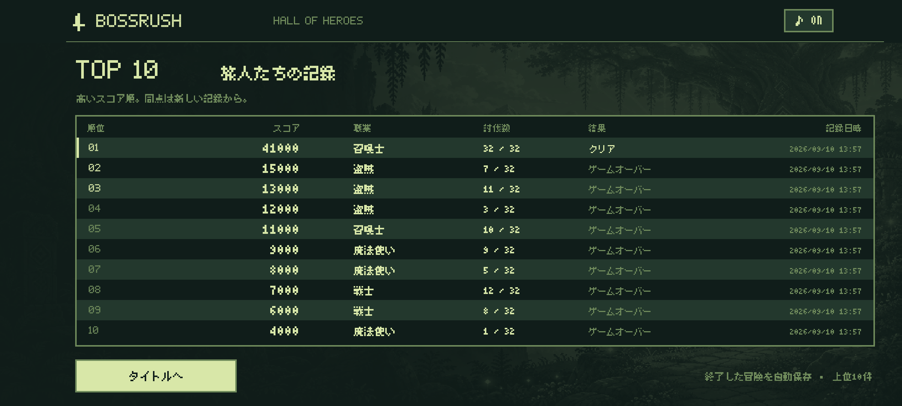

# BOSSRUSH 1.0.19 — ハイスコア TOP 10

## 操作と保存

スタートメニューの「ハイスコア」から上位10件を1画面で閲覧できます。スコア・職業・討伐数・クリア／ゲームオーバー・記録日時を表示します。タッチとコントローラーで開け、「タイトルへ」、Androidの戻る、コントローラーのBで戻れます。この画面とタイトルは無音です。

ゲームオーバー、またはゲームクリアが確定したときに冒険の合計スコアを1件保存します。物語ありの冒険では、従来の結果確定と同じく終章の終了時に保存します。ボス単体の撃破、途中の中断、新しい冒険の開始では記録を追加しません。

- スコアの降順に最大10件。11件目以降は低いスコアから除外します。
- 同点は新しい記録日時を優先。同じスコアを出した別の冒険は別々に保存します。
- 最初のボスを倒せずに終了した0点の記録も対象です。
- 新しい冒険を始めても履歴は保持します。閲覧するだけでは進行中の冒険・音量設定・クリア回数を変更しません。
- 日時は終了時の端末時計を保存し、端末のタイムゾーンで表示します。クラウド同期や通信はありません。

上の画像は、検証用の終了記録を保存し、プロセス終了・再起動後にスタートメニューから開いた画面です。実際のユーザーのプレイ記録ではありません。

## 旧版からの引き継ぎ

1.0.18以前は最高スコアの数値1件だけを保存していました。正の最高スコアが残っている場合は「以前の最高記録」として引き継ぎます。保存されていない職業・討伐数・結果・日時は推測せず、不明として表示します。同じ最高記録を再起動のたびに追加することはありません。既に同じか高いスコアが履歴に存在するときも追加しません。

旧版で保存していなかった他の過去のプレイは復元できません。今後の終了記録と、この引き継ぎ記録を合わせて上位10件を保持します。

## 実装

`HighScores` が不正な記録の除外・順位付け・10件への制限・旧最高記録の引き継ぎを担当します。`ScoreHistoryCodec` がバージョン付きJSONを読み書きします。一部の行が壊れていても、読み取れる他の行は残します。

`ScoreHistory` は既存の `bossrush` SharedPreferencesに `scores` キーを追加します。終了時には、ランキング・既存の最高値・クリア回数・進行中チェックポイントの削除を同じ編集で保存します。既存の `GameEngine.resultRecorded` によって同じ終了処理を重複登録しません。

冒険のセーブ形式とスコア計算は変更していません。

## 検証

2026-09-10、versionName `1.0.19` / versionCode `20`。

- `testDebugUnitTest`：108件成功、失敗0。追加4件で上位10件の保持・低スコアの除外・同点の順位・同じスコアの別プレイ・旧最高記録の引き継ぎ・0点・無効な記録の除外を検証。
- `lintDebug`：エラー0、警告32。Debug APKとAndroidテストAPKのビルド成功。物語・日本語フォントのチェック成功。
- API 35エミュレーター：関連9項目の最終結果が成功。空の履歴、タッチ／コントローラーからの閲覧、旧最高値の一度だけの引き継ぎ、冒険・設定・クリア回数の保持、13回のゲームオーバーとクリアからの上位10件、重複登録防止、再起動、新しい冒険での保持、JSON読み書きと壊れた行からの回復を検証。
- 横画面の両向き、1920×1080・2400×1080・左右カメラ穴付き2424×1080・1600×1200で画面内に収まることを確認。終章を読み終えるまでクリア履歴へ加えないこと、既存の盗賊の戦利品とエンディング、コントローラーでの冒険開始も確認。
- 表示検査の調整後、画面サイズ検査と上位10件保存の2項目を再実行し、2件成功（17.557秒）。
- 最後にエミュレーターのアプリを強制終了し、新しいプロセスで起動。スタートメニューの「ハイスコア」をタップし、1位41,000点・10位4,000点を画面のアクセシビリティ情報で確認。保存値が変わらないことも確認。
- 10件一覧、旧最高記録、通常の横画面とタブレットの画像を目視確認。

## APKと実機

- APK：`artifacts/delivery/high-scores-1.0.19/BOSSRUSH-1.0.19-debug.apk`（173,624,991 bytes）。
- SHA-256：`5b292d1c04118cb30eb8ede12a507cb2199d14cc03a969b87af71ca875f42c99`。
- Debug署名の証明書SHA-256：`2c53b411c1193758289715cc230989564a571259b2eb4f5702b774c07a515e87`。従来と一致し、署名・16 KB zipalign検査も成功。
- Pixel 10aへ更新インストール成功。versionName `1.0.19` / versionCode `20`、端末内APKのSHA-256が上記の検証済みAPKと一致。MainActivityの前面起動と、アプリのログに致命的例外がないことを確認。
- 実機で旧最高スコアと一致する「以前の最高記録」1件への移行、および既存の進行中の冒険・最高値・クリア回数・音設定の保存キーが存在することを確認。
- 実機の既存保存値は更新前後のハッシュが一致しなかったため、内容の完全保持を実機で検証できたとはしていません。差分照合用の元の値を取得していないため、変更された項目は特定できません。エミュレーターでは保存内容を比較して保持を確認しています。実機へのタッチ・キー入力は行っていません。
