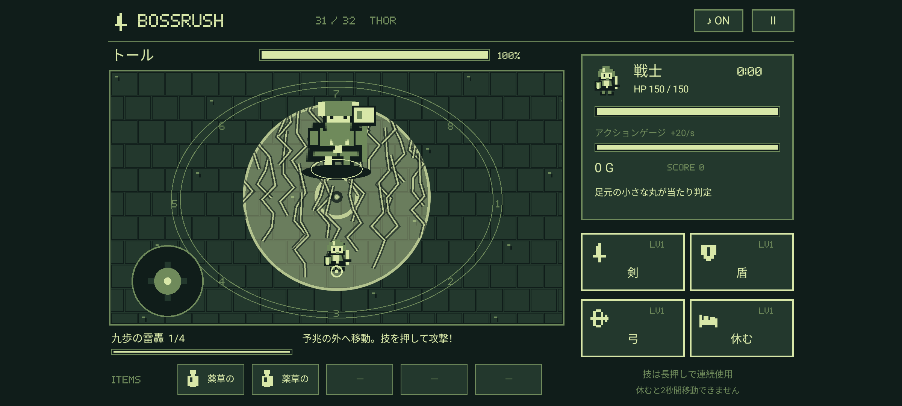
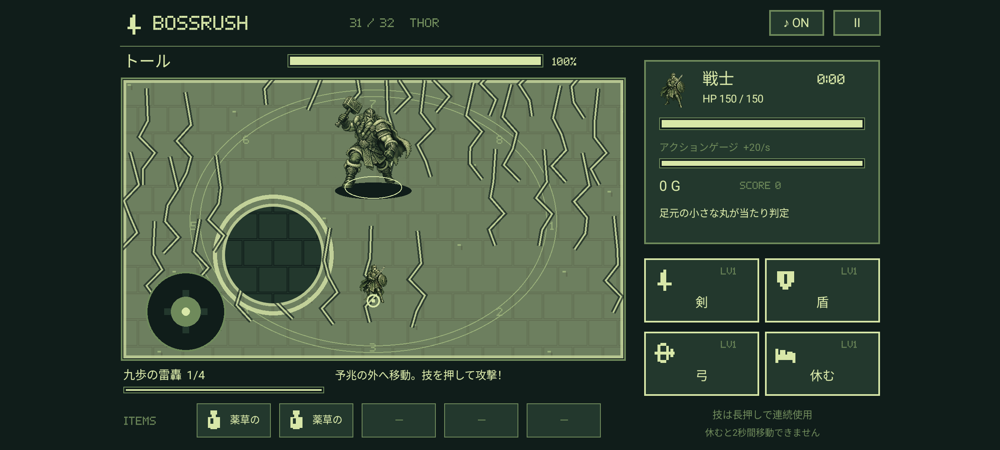

# BOSSRUSH 1.0.12 楽曲・戦闘演出

全32体の専用戦闘曲、ショップ・報酬、エンディングの**計34曲を、ピアノ＋ロックの編成へ変更**しました。タイトルは引き続き無音です。音声は端末に同梱し、オフラインで再生できます。

## 和声・演奏・ループ

すべての曲にZUN進行の基本形 **♭VI → ♭VII → i → i** を使用します。A短調なら **F → G → Am → Am**。VI・VIIは長三和音、主和音は短三和音。ギターのパワーコードに加え、ピアノの左手と強拍の旋律で和音の長短を示します。

呼称・基本形は[針の音楽『東方曲の和音とコード進行の考察』試読版](https://harimusic.net/pdf/trial002.pdf)を参考にしています。楽曲の主題・応答・編曲は本作向けに制作し、既存曲の旋律・採譜・録音は使用していません。

- **ピアノ**：右手の主旋律、装飾音、左手の分散和音。全32体で異なる主題A/Bを使い、応答、間奏、終盤の高音域やオクターブで展開します。
- **エレキギター**：左右に分けた歪みギターとオーバードライブ。短い刻み、開放的な長音、休符を曲の特徴に合わせて使います。ショップ・エンディングはクリーンギターです。
- **ベース・ドラム**：オクターブと五度を交えたベース、キック・スネア・ハイハット、節目のフィル。雷・獣・炎は連打、石の巨人は3打、ロキは3拍子上のずれたアクセント。
- **神話の補助音色**：氷や黄金のベル、角笛、風の弦、冥界の声などを控えめに重ねます。ピアノとロック編成を中心に保ちます。

戦闘曲は192〜232 BPM。曲ごとに4小節単位で長さを調整し、**28.24〜32.31秒**で1周します。小節を途中で切らず、主題→応答→間奏→盛り上がり→次の主題へつなぎます。ショップは128 BPM・30秒の軽快な休息、エンディングは96 BPM・30秒で、静かなピアノからバンドが加わる構成です。エンディングも同じ和声を使い、強さと音域で色が戻る場面を表現します。

神話の特徴は[散文エッダ（R. B. Anderson訳）](https://www.gutenberg.org/files/18947/18947-h/18947-h.htm)と[制作資料](DESIGN.md)を踏まえた創作表現です。古代の音楽の復元ではありません。

## 全曲一覧

| # | 場面・ボス | 曲名 | BPM | 拍子 | 1周 | モチーフ |
| --- | --- | --- | ---: | --- | ---: | --- |
| 01 | ラタトスク | 枝先のいたずら | 204 | 4/4 | 28.24秒 | 枝を跳ぶ高音と、伝言を返す短い応答 |
| 02 | ダーイン | 翠枝の角笛 | 192 | 4/4 | 30.00秒 | 枝葉を揺らす角笛と、四本の蹄の拍動 |
| 03 | グリンブルスティ | 黄金の蹄 | 208 | 4/4 | 32.31秒 | 金毛の輝く上昇句と、猪の突進ベース |
| 04 | フギン | 黒翼の問い | 212 | 4/4 | 31.70秒 | 問い掛ける鴉の跳躍と、鋭い返答 |
| 05 | ムニン | 忘れられた空 | 200 | 4/4 | 28.80秒 | 記憶の旋律を一拍遅れで追う二声 |
| 06 | タングリスニ | 雷雲の蹄音 | 216 | 4/4 | 31.11秒 | 雷車の蹄を刻む二連打と低い角笛 |
| 07 | スコル | 日蝕の疾走 | 224 | 4/4 | 30.00秒 | 太陽へ駆け上がる音列と追跡の連打 |
| 08 | ハティ | 銀月の追走 | 220 | 4/4 | 30.55秒 | 月へ回り込む下降句と裏拍の追走 |
| 09 | フレースヴェルグ | 北端の風鳴り | 200 | 4/4 | 28.80秒 | 羽ばたく長い旋律と、北風を描く弦の残響 |
| 10 | スィアチ | 奪われた春 | 208 | 4/4 | 32.31秒 | 急降下する翼と、奪われた春の高音 |
| 11 | スカジ | 白銀を射る | 216 | 4/4 | 31.11秒 | 氷の短音と、矢のような高音の跳躍 |
| 12 | ウル | イチイの弦 | 204 | 4/4 | 28.24秒 | 弦を弾く短い音と、誓いを告げる上昇句 |
| 13 | エーギル | 荒波の祝宴 | 196 | 4/4 | 29.39秒 | 荒波の上下運動と、宴の三連アクセント |
| 14 | ラーン | 深海の糸 | 208 | 4/4 | 32.31秒 | 絡みつく二声の網と、沈む低音 |
| 15 | ニョルズ | 帰港なき帆 | 200 | 4/4 | 28.80秒 | 帆を押す上昇音と、航路を刻む低音 |
| 16 | ヨルムンガンド | 世界を締める環 | 224 | 4/4 | 30.00秒 | 尾に戻る循環旋律と、世界を締める低音 |
| 17 | ガルム | 鎖の向こう | 220 | 4/4 | 30.55秒 | 番犬の吠える低音と鎖を叩く裏拍 |
| 18 | ヘル | 半分だけの心臓 | 192 | 4/4 | 30.00秒 | 高音と低音を交互に鳴らす二つの顔 |
| 19 | ニーズヘッグ | 朽ちる根の歌 | 224 | 4/4 | 30.00秒 | 根を齧る断続音と下へ崩れる音列 |
| 20 | フェンリル | 解き放たれた顎 | 228 | 4/4 | 29.47秒 | 鎖を断つ休符明けの強打と獣の連打 |
| 21 | フルングニル | 三角の鼓動 | 208 | 4/4 | 32.31秒 | 石心の三打アクセントと砥石の低音 |
| 22 | スリュム | 霜王の婚礼 | 204 | 4/4 | 28.24秒 | 霜の婚礼を刻む重い行進と凍る残響 |
| 23 | ウートガルザロキ | 偽りの広間 | 224 | 4/4 | 30.00秒 | 音色を入れ替える幻術とずれる拍頭 |
| 24 | スルト | 燃え尽きる天 | 232 | 4/4 | 28.97秒 | 炎剣が駆け上がる音列と燃え続ける連打 |
| 25 | イズン | 春を守る戦い | 204 | 4/4 | 28.24秒 | 芽吹く高音の装飾と、林檎を守る切迫感 |
| 26 | フレイ | 実りの剣舞 | 216 | 4/4 | 31.11秒 | 鹿角の上昇句と自ら踊る剣の分散和音 |
| 27 | フレイヤ | 黄金の涙 | 220 | 4/4 | 30.55秒 | 黄金の装飾音と、セイズの呪文の応答 |
| 28 | テュール | 隻腕の誓約 | 216 | 4/4 | 31.11秒 | 誓いの行進、片腕を表す一拍の空白 |
| 29 | ヘイムダル | 終わりを告げる角笛 | 224 | 4/4 | 30.00秒 | 終末を告げる角笛の五度と虹橋の上昇 |
| 30 | ロキ | 千の顔のワルツ | 228 | 3/4 | 31.58秒 | 三拍子の顔を変える二拍アクセント |
| 31 | トール | 九歩の雷鳴 | 232 | 4/4 | 28.97秒 | 鎚の四分連打、二重キックと雷鳴の下降 |
| 32 | オーディン | 隻眼の夜明け | 228 | 4/4 | 29.47秒 | 槍の鋭い主旋律と、二羽の鴉の応答 |
| 33 | ショップ・報酬 | 世界樹の灯り | 128 | 4/4 | 30.00秒 | ピアノとクリーンギターが会話する、旅の休息 |
| 34 | エンディング | 色づく世界の約束 | 96 | 4/4 | 30.00秒 | 独奏に近いピアノから、光が戻るギターの広がりへ |

## タイトルと再生動作

タイトル・職業選択・図鑑・遊び方・ゲームオーバーにはBGMを割り当てません。操作SEは鳴ります。ボス紹介・戦闘・カットイン・ゲーム内の一時停止は同じボス曲を続け、報酬・ショップではショップ曲、クリア時はエンディング曲へ切り替えます。カットインから戻るたびに曲が先頭へ戻ることはありません。

44.1 kHz・ステレオのOgg Vorbisを別スレッドでPCMへ復号し、AudioTrackで再生します。直近2曲をキャッシュし、ループ中はファイル読み込みも復号も行いません。3周分の演奏から残響が安定した3周目を収録。復号端の約1.45msを接続補正し、末尾に無音を挿入しません。読み込み完了時には現在の画面を再確認し、タイトル・ミュート・バックグラウンド移行時の古い曲の再開を防ぎます。

原音の目標音量は戦闘−15 LUFS、ショップ−16 LUFS、エンディング−17 LUFS、真のピーク−2 dBTP。端末ではさらにBGMレベル・SEダッキング・マスター音量を適用します。音量の数字は端末スピーカーの音圧を保証する値ではありません。

## 音源と制作記録

作曲データは [`tools/music/scores.json`](../tools/music/scores.json)、編曲・書き出しは [`tools/music/render.py`](../tools/music/render.py)、全曲のMIDIは [`tools/music/midi/`](../tools/music/midi/) です。ゲーム用音声と長さ・BPM・ハッシュの一覧は [`app/src/main/assets/music/manifest.json`](../app/src/main/assets/music/manifest.json)。元のパルス波BGMは再生経路から除去し、既存の攻撃SEのみ合成音を引き継いでいます。

楽器には **S. Christian Collins / GeneralUser GS 2.0.3**、演奏レンダリングには **FluidSynth 2.5.6**、音量調整とOgg変換にはFFmpegを使用しています。SoundFontそのものやFluidSynthをAPKへ組み込まず、生成した楽曲の録音を収録しています。

- [GeneralUser GS公式ページ](https://schristiancollins.com/generaluser.php)
- [使用版の公式ライセンス](https://github.com/mrbumpy409/GeneralUser-GS/blob/684543d5e5efaef08d02be50dcda8d552478fa60/documentation/LICENSE.txt) / [保存した本文](licenses/GeneralUser-GS.txt)
- 上記ライセンスは私的・商用の音楽制作と録音の利用を認めています。一部サンプルの由来について作者が完全には確認できていない旨も記載されており、その本文を省略せず保存しています。
- SoundFont SHA-256: `9575028c7a1f589f5770fccc8cff2734566af40cd26ed836944e9a5152688cfe`、公式リポジトリのコミット `684543d5e5efaef08d02be50dcda8d552478fa60`。

再生成にはPython 3＋NumPy、FluidSynth共有ライブラリ、FFmpeg、上記ハッシュのSoundFontを用意します。レンダラーはファイルを自動ダウンロードしません。

```sh
python3 tools/music/render.py --soundfont /path/to/GeneralUser-GS.sf2 --library /path/to/libfluidsynth.so.3
python3 tools/check-music.py
python3 tools/check-music.py --audio
```

`--only thor skadi loki` のように曲を指定して再生成できます。試聴WAVは**APKに収録したOggから復号**して `artifacts/music-1.0.12/` に出力します。曲の差し替え後は全曲のマニフェストとハッシュを再検査してください。

## 主人公のSE

- 剣：金属の下降音と斬撃ノイズ。ナイフ：高く短い切断音。
- 弓：弦と風切りの発射音、別の着弾音。
- 炎：上昇する点火音、低い破裂音。氷：高い結晶音、時間差の砕氷音。
- 巨人・白ウサギ・はにわ：異なる召喚音。巨人の自動攻撃は重い打撃、はにわの再使用は陶器の打撃音。
- 盾・魔力強化・気合い・休むにも用途別の効果音。射程外・待機中・ゲージ不足など、技が成立しない場合は攻撃音を鳴らしません。

最大8音を同時に最後まで再生でき、音の重なりで直前の攻撃が切れません。8音を超えた場合のみ最古の音を終了します。SE中はBGMを58%へ素早く下げ、終了後に滑らかに戻します。最終ミックスはソフト飽和処理でPCMのオーバーフローを防ぎます。右上の音スイッチはBGMとSEの両方に作用します。

## 敵の攻撃演出

全16パターンで、斜線が流れる予兆、固定した境界、発動への収束、ボスの詠唱オーラを表示。発動時は攻撃範囲の光、直線の光柱、扇状の放射線、円と吹き飛ばしの多重衝撃波を描きます。

さらに神の系統ごとに、雷の稲妻、氷柱、波と飛沫、火柱、風の流線、冥界の暗い輪、石の破片、光のルーンを追加。通常攻撃は0.60秒、必殺技は0.78秒の残光を持ち、必殺技は破片の数と光の強さを増やします。1.0.7のカットインは神話の紋章・石造の神殿・世界樹を描いたドット絵です。

演出は実際の攻撃領域で切り抜きます。残光→次の予兆→キャラクター→主人公の足元の順に描くため、安全地帯と当たり判定の印を確認できます。残光に当たり判定はありません。現在の敵の威力・予兆・二重詠唱は[戦闘仕様](COMBAT.md)を参照してください。



上の画像はトールの属性演出を確認するために用意した描画用の状態です。




## 検証

実行結果と実機インストールの証跡は [1.0.12の検証記録](MUSIC_VALIDATION.md) を参照してください。

`tools/check-music.py` は34曲の網羅性、独立した音声ハッシュ、MIDI、楽曲データ、Oggのサンプル数、BPM・拍子・小節数、出典を検査します。`--audio` は実際の音声を復号し、全曲の音量・ピーク・ステレオ成分・10ms単位の無音区間・接続補正後の端点を調べます。

`MusicTest` はタイトルの無音、曲選択、全曲の長さ、ZUN進行、音声ミキサーの連続ループ・ミュート・SEダッキング・飽和処理、出力サンプリング周波数を変えた後のSEの長さを検査します。`MusicPlaybackTest` はエミュレーターのAndroid MediaCodecでAPK内34曲を実際に復号し、各曲2周をランタイムミキサーに通します。さらにAudioTrack出力、素早い曲変更、タイトル、ミュート、停止・再開を確認します。検証は音声データと再生処理の確認であり、実機スピーカーによる聴感評価とは別です。

`FeedbackRenderTest` は全16攻撃パターンと代表ボスの予兆・発動を検査します。現在の攻撃演出・技成長の仕様は [COMBAT.md](COMBAT.md) と [SKILL_GROWTH.md](SKILL_GROWTH.md) を参照してください。
