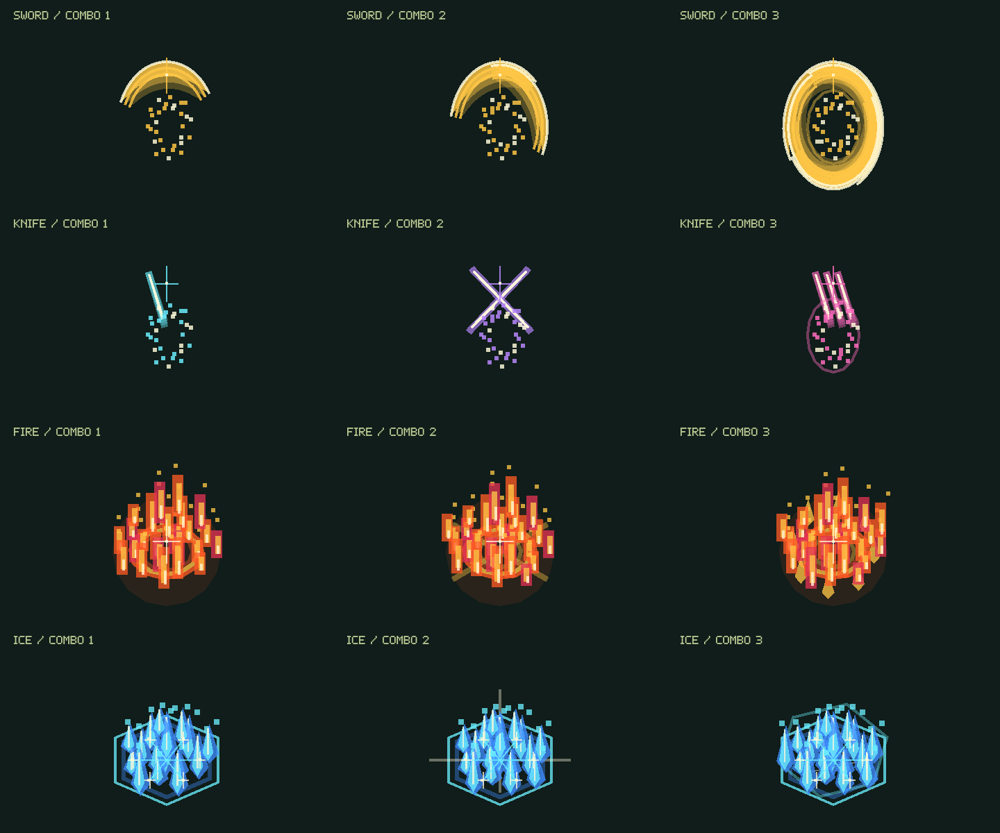
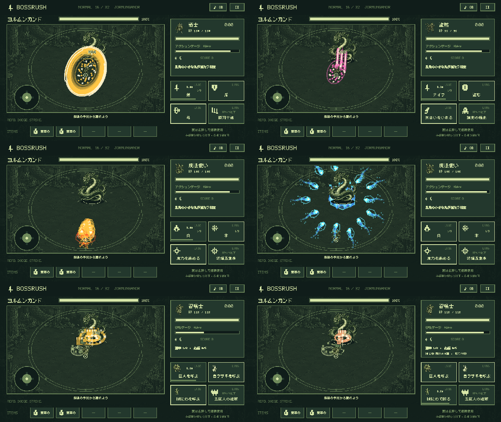

# BOSSRUSH 1.0.23 — 3段コンボと主人公の攻撃演出

2026-09-16。正式版1.0.22からの更新。versionName `1.0.23`、versionCode `24`。

## 操作とコンボ

戦士の剣、盗賊のナイフ、魔法使いの炎・氷は、同じ技を続けて使うと **1→2→3→1** と進みます。タップとコントローラーで同じ処理を使用し、長押しによる連続使用にも対応します。技ボタンの `1/3` などの表示は「次に出す段」です。

- 各技を使った時点から、その技の通常の待機時間＋2.4秒がコンボ継続時間です。時間を過ぎると1段目に戻ります。
- 炎と氷の段数は独立。交互に使っても、それぞれのコンボを続けられます。
- ゲージ不足・射程外・待機中など、発動できなかった入力では段数を進めません。
- 一時停止やボスのカットイン中は、継続時間・弾・演出の時間も停止します。
- 次のボス戦は1段目から。コンボは戦闘中の状態で、セーブ形式の変更はありません。

## 職業ごとの演出

| 技 | 1段目 | 2段目 | 3段目 |
| --- | --- | --- | --- |
| 戦士・剣 | 金色の大きな薙ぎ払い | 逆方向への切り返しと重なる残光 | 円を描く大回転斬りと衝撃波 |
| 盗賊・ナイフ | 水色の鋭い突き | 紫色の交差斬り | 桃色の3本の斬撃残像と輪状の残光 |
| 魔法使い・炎 | 前方へ広がる火球 | 左右から放つ二筋の火球 | 広い扇形の火球群と放射状の火花 |
| 魔法使い・氷 | 照準地点への氷柱と収束する氷弾 | 十字方向から集中する氷弾 | 二重の距離から押し寄せる氷弾と雪の結晶 |

炎には赤・橙・金・白、氷には青・水色・白を使用。発射時の紋章、飛行中の尾、着弾時の火柱・氷柱・破片を強化しました。剣・ナイフ・炎・氷のSEも段ごとに変わります。戦士の弓にも金色の軌跡と着弾の光を追加しています。

巨人とはにわは、攻撃に合わせて体を前へ踏み込み、腕を伸ばし、拳を敵へ打ち込んで戻します。拳の軌道・腕・指・破片をドットの形で描きます。巨人の自動攻撃と必殺技で呼んだ5体、はにわの再使用攻撃に同じ仕組みを適用します。はにわの身代わりには防御の光を使い、殴る動作と区別しています。

## 魔法の成長と当たり判定

各技のレベルで弾幕が成長します。3レベル上がるごとに2発増え、コンボを進めるごとにさらに2発増えます。

| 技レベル | 1段目 | 2段目 | 3段目 |
| --- | ---: | ---: | ---: |
| 1〜3 | 1 | 3 | 5 |
| 4〜6 | 3 | 5 | 7 |
| 7〜9 | 5 | 7 | 9 |
| 10〜12 | 7 | 9 | 11 |
| 13〜15 | 9 | 11 | 13 |
| 16 | 11 | 13 | 15 |

炎は表の数だけ火球が飛びます。氷は照準地点への中心攻撃1発と、残りの数の氷弾で構成します。例えばLv.16の3段目は、中心攻撃1発＋収束する氷弾14発です。

飛んでいる魔法弾は、実際に敵への当たり判定とダメージを持ちます。炎は発射時の方向へ直進。氷は約0.4秒追尾してから照準を固定し、約0.75秒で中心攻撃、その地点に周囲の氷弾が収束します。固定後の照準や発射済みの弾は敵を追い直しません。ボスが移動すれば外れることがあります。高速移動中の接触は、前後フレームの相対的な経路から判定します。

## 威力とバランス

コンボの威力倍率は **1段目1.00倍／2段目1.15倍／3段目1.35倍**。技の基本威力・範囲・待機時間のレベル成長は既存の式を使用します。同じコンボ段で比較したLv.1の総威力はLv.16の25%です。

魔法は「その段の総威力÷攻撃数」を各攻撃に割り当てます。弾数が増えただけで総威力が15倍になる処理ではありません。全弾命中すればその段の総威力となり、外れた分のダメージは発生しません。近接技は1回の発動につきダメージ1回で、追加の斬撃線や火花は描画だけです。召喚獣の打撃も、拳の残像で重複ダメージを発生させません。

ボスのHPは新コンボ・魔法弾も含む30秒の攻撃シミュレーションから算出します。前版の移動速度・ボス速度1.25倍、強化された敵弾幕、通常／ハード、既存の必殺技・はにわの耐久・白ウサギの回復を引き継ぎます。

## 見やすさと負荷

- 床に広がる魔法演出の上に敵の予兆を描きます。近接の刃や拳はキャラクターの手前に表示します。
- 敵の弾とプレイヤーの足元の当たり判定は、主人公の攻撃演出より手前に描きます。
- 全画面を真っ白にする通常攻撃の点滅は使わず、発光は攻撃の周辺に限定します。
- 主人公の演出は最大72件。魔法弾は、予約中の氷弾も含め128発以内に制限します。
- ダメージ計算と描画は分離。一時停止中は見た目を描き直しても攻撃が進みません。

## 検証と公開用データ

`PlayerComboTest` は段数・入力失敗・継続時間・全16レベルの魔法弾と総威力・氷弾の照準固定・カットインでの停止・弾数上限・召喚獣の動きを確認します。既存の成長・30秒HP・被弾・セーブ互換性テストも使用します。

Androidでは、段ごとの描画の違いと炎・氷の色、6種類の攻撃の連続フレーム、Lv.1/8/16での成長、足元の目印、タッチとコントローラーの混在操作、既存の必殺技・はにわ・白ウサギ・ポーズを検証します。比較画像は開発用の固定配置です。市販端末すべてのフレームレートを保証するベンチマークではありません。

検証結果：JVMテスト131件成功、API 35エミュレーターの操作・描画テスト11件成功。`testDebugUnitTest lintRelease assembleDebug assembleDebugAndroidTest bundleRelease` 成功。Lintはエラー0件、警告36件（KTX利用の提案や依存関係の更新案など）。キャラクター39体・背景33枚・BGM34曲・物語32章のアセット検査も成功しました。

署名済みAABから生成した正式版APKで1.0.22→1.0.23の上書き更新を実施し、魔法使いの序章の保存ページ・本文が一致することを確認しました。正式版で炎の3段コンボ、氷、ポーズ・タッチによる再開、プロセス終了後の再開も確認しています。物理端末への更新は行っていません。

公開用のAAB、検証の確定結果、更新試験の記録、リリースノートは `play/release/1.0.23/` にまとめます。パッケージとアップロード鍵は1.0.22と同じです。今回の作業にはPlay Consoleへのアップロード・審査提出・公開は含みません。
