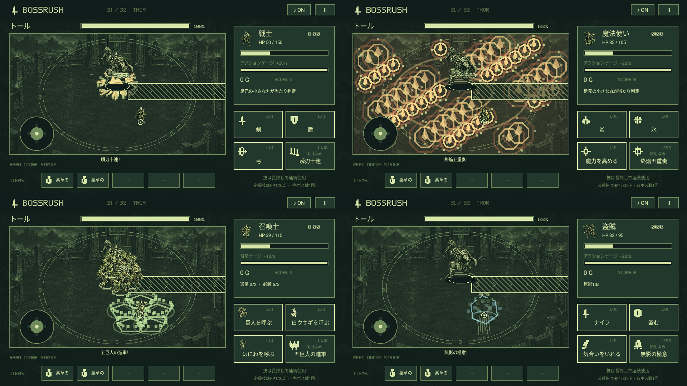

# 主人公の必殺技 / 1.0.13

4職業の4番目の技を「休む」から職業固有の必殺技へ変更しました。発動時のHPが最大HPの**3分の1以下（ちょうど3分の1を含む）**で、**各ボス戦1回**だけ使用できます。ゲージ消費・待機時間はありません。戦闘画面の技4、ゲームパッドのY、キーボードの4から発動します。

ボタンは「HP1/3以下」→「発動可能」→「使用済み」と表示されます。使用前に回復してHPが3分の1を超えると発動できなくなります。使用後にHPを回復して再び減らしても、砂時計でゲージと待機を戻しても、長押ししても再使用できません。次のボス戦開始時に使用回数が戻ります。

## 4つの技

| 職業 | 必殺技 | 効果 |
|---|---|---|
| 戦士 | 瞬刃十連 | ボスとの距離にかかわらず10連続強攻撃。最初の命中から最後まで0.144秒。十字に交わる黄金色の斬撃と火花 |
| 魔法使い | 終焔五重奏 | 戦場全域に0.24秒間隔で5回の強い爆発。ボスが移動しても命中。爆発紋・光柱・火花を全域に展開 |
| 召喚士 | 五巨人の進軍 | 通常枠と別枠で5体の巨人を同時召喚。通常2体を保持したまま最大7体。5体はボスの周囲へ別々の位置で追従・攻撃 |
| 盗賊 | 無影の極意 | 姿を薄くして10秒間無敵。移動・通常技・アイテムは使用可能。ダメージと吹き飛ばしを防ぎ、残り時間を表示 |

いずれも「休む」の移動停止やHP回復はありません。回復には薬草のしずくや白ウサギを使います。盗賊の必殺技はアイテムの透明化と別のタイマーなので、効果中に6秒の透明化アイテムを使っても10秒の効果を短縮しません。

## 技レベル

以前の「休む」の技レベルを同じ4番目の枠に引き継ぎます。戦闘後もほかの技と同じ選択・取り消し・確定で強化できます。上限Lv.16、基本威力はLv.1で最大値の25%、1レベルごとに最大値の5%ずつ成長します。

| 技 | Lv.1 | Lv.8 | Lv.16 |
|---|---:|---:|---:|
| 瞬刃十連・1発の基本威力 | 60 | 144 | 240 |
| 終焔五重奏・1爆発の基本威力 | 120 | 288 | 480 |
| 五巨人の進軍・1体の拳の基本威力 | 24 | 57.6 | 96 |
| 五巨人の進軍・召喚時間 | 12秒 | 約15.73秒 | 20秒 |
| 無影の極意・無敵時間 | 10秒 | 10秒 | 10秒 |

実ダメージには通常技と同様にステージ・攻撃強化などの補正が掛かります。戦士・魔法使いは攻撃回数と命中範囲を固定し、威力とエフェクトを強化。召喚士の巨人は4番目の技の威力・拳の範囲・持続時間・演出で成長します。盗賊の無敵時間は指定どおり全レベル10秒固定で、レベルアップは演出のみを強化します。

## 戦闘・保存との連携

- ボスがHP半分で必殺技の初回カットインに入ると、主人公の連続攻撃を一時停止。途中で制限されたダメージと残りの回数を保持し、カットイン後に続行します。ボスの初回必殺技を飛ばすことも、主人公の残りの攻撃を捨てることもありません。
- 一時停止・アイテム画面・アプリのバックグラウンド中は、連撃・爆発・召喚時間・無敵時間が進みません。
- ボス撃破・ゲームオーバー・タイトルへ戻ると、進行中の連続攻撃を終了します。次の戦闘に追加ダメージを持ち越しません。
- 再開は従来どおり戦闘前のチェックポイントからです。その戦闘全体をやり直すため、使用済み状態だけを前の試行から引き継ぐことはありません。4枠の技レベルと保存形式は維持します。
- 主人公の必殺技は30秒の通常攻撃によるボスHP試算へ含めません。
- エフェクトは敵の予兆より下に描き、主人公の足元の当たり判定は最後に表示します。専用SEを追加し、既存のBGMとSEダッキングを使用します。

## 検証

`PlayerFinisherTest` はHP境界、戦闘外・HP0での拒否、各戦1回、砂時計と回復による再使用防止、攻撃回数・総ダメージ・射程、ボスのカットイン、終了時の破棄、通常2体と巨人5体の両立、4番目の技レベル、無敵10秒・吹き飛ばし・一時停止を検査します。

`PlayerFinisherUiTest` はエミュレーターで4番目のボタンをタッチし、HP条件と再使用防止、強化の選択・キャンセル・確定を検査します。描画テストは4職業のテスト用状態を作り、実際のCanvasで専用演出と足元の目印を確認します。`ControllerTest` ではYボタンでも必殺技が発動することを検査します。

上の画像は演出確認用にHP・技レベル・ボスHPを設定した状態で、全ボスを手操作で倒した記録ではありません。

### 2026-09-10の実行結果

- versionName `1.0.13` / versionCode `14`。
- `testDebugUnitTest`：**84件成功**。
- `lintDebug`：エラー0件。`assembleDebug`・`assembleRelease`・`assembleDebugAndroidTest` 成功。
- エミュレーター：`PlayerFinisherUiTest` 2件、`ControllerTest` の4職業・全ボタンテスト1件、`PlayerGrowthRenderTest` 1件の **計4件成功（56.336秒）**。全19種類の主人公エフェクトについてLv.1・8・16の成長と、戦闘中の足元の目印を検査。
- Pixel 10a：同一APKを `adb install --no-incremental -r` で更新。1.0.13 / code 14、MainActivityの起動・プロセス稼働、アプリに警告・クラッシュログがないことを確認。インストール直後の最初のPID取得は空でしたが、その後の確認では起動中の同一画面とPIDを確認できています。
- インストールされたAPKのハッシュは検証済みAPKと一致。保存データのハッシュは前回の1.0.12配布後の記録と一致。物理端末へのタッチ・キー注入は行っていません。

APK：`artifacts/delivery/finishers-1.0.13/BOSSRUSH-1.0.13-debug.apk`

SHA-256：`9f1a075665315f9371d6340764e288258107004307f1401ebbddd1c6b3245beb`

署名証明書SHA-256：`2c53b411c1193758289715cc230989564a571259b2eb4f5702b774c07a515e87`（従来と同じ開発署名）。release APKはビルド確認用の未署名成果物です。

詳細ログ・実機更新記録は `artifacts/delivery/finishers-1.0.13/`、描画画像は `artifacts/finishers-1.0.13/finishers/` に保存しています。
