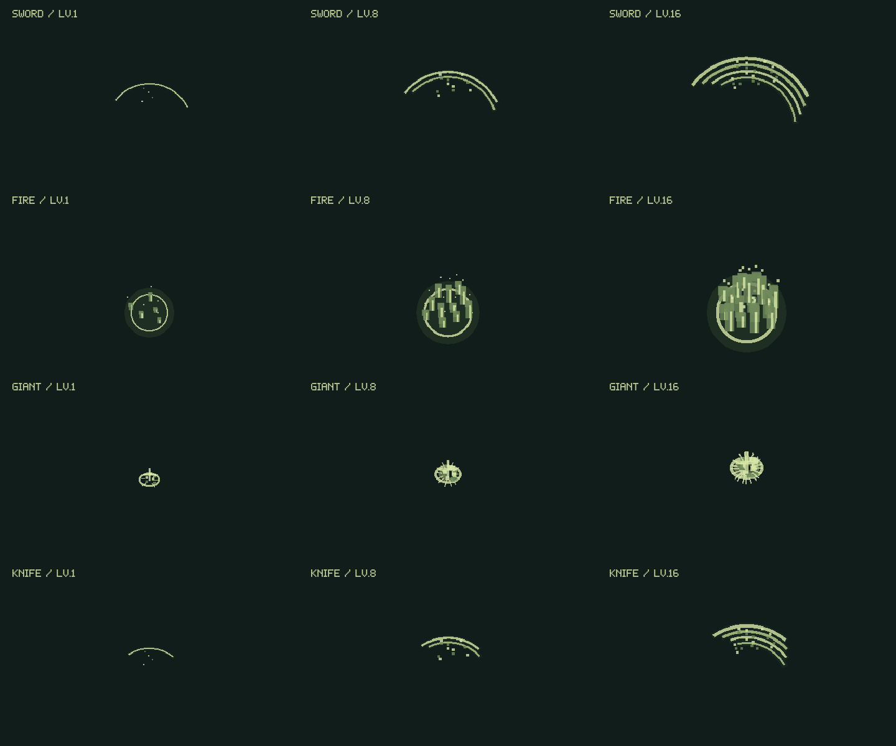

# 技の成長とエフェクト

1.0.11では4職業すべての技について、技レベルが上がるほど効果と見た目が成長します。成長は職業レベルではなく、選んで強化した各技のLv.1〜16に連動します。

## 威力と範囲

従来の直線成長を維持しています。技の基本威力はLv.1で最大値の25%、Lv.8で60%、Lv.16で100%。範囲は初期値の1倍・1.28倍・1.6倍、待機時間は初期値の1倍・0.79倍・0.55倍です。

以下はステージ補正・強化アイテムなどを掛ける前の基本値です。範囲の単位はゲーム内の座標です。近接技・魔法は敵の当たり判定が範囲に触れた場合にも命中します。

| 技 | Lv.1 → Lv.8 → Lv.16 の威力・回復量 | Lv.1 → Lv.8 → Lv.16 の範囲 |
| --- | --- | --- |
| 戦士・剣 | 36 → 86.4 → 144 | 67 → 85.76 → 107.2 |
| 戦士・弓 | 11 → 26.4 → 44 | 矢幅 12 → 15.36 → 19.2、射程 650 → 832 → 1040 |
| 魔法使い・炎 | 22 → 52.8 → 88 | 爆発半径 38 → 48.64 → 60.8 |
| 魔法使い・氷 | 23 → 55.2 → 92 | 着弾半径 38 → 48.64 → 60.8 |
| 召喚士・巨人の拳 | 24 → 57.6 → 96 | 65 → 83.2 → 104 |
| 召喚士・白ウサギの回復 | 16 → 38.4 → 64 | 80 → 102.4 → 128 |
| 召喚士・はにわで殴る | 16 → 38.4 → 64 | 68 → 87.04 → 108.8 |
| 盗賊・ナイフ | 25 → 60 → 100 | 59 → 75.52 → 94.4 |
| 盗賊・盗む | 各ボス1回、範囲内で確定成功 | 77 → 98.56 → 123.2 |
| 全職業・休む | 40 → 96 → 160 | 自分に効果。最大HPまで回復 |

盾・魔力強化・気合いは自分に効果があり、軽減率・攻撃強化・移動速度の倍率と持続時間が成長します。見た目のオーラが広がっても、周囲の敵への攻撃にはなりません。はにわの正面軽減は75%、同時召喚は最大2体、召喚ゲージ回復はほかの職業の半分です。

## 職業ごとの見た目

- **戦士**：実際の射程に合わせて広がる剣の斬撃、重なる残光と火花。弓は矢先・軸・羽根・軌跡が太くなり、命中時の光も増えます。盾は大きな六角の結界と紋章へ成長します。
- **魔法使い**：炎は火球と火の尾が大きくなり、爆発時の火柱と火の粉が増えます。氷は照準の霜の結晶から、大きな氷柱と周囲の破片へ成長します。魔力強化では周回する紋章が増えます。
- **召喚士**：召喚獣の足元の紋章と登場時の粒子が増え、姿も最大20%大きくなります。巨人は拳の衝撃波と砕ける岩、はにわは打撃の輪と破片、白ウサギは回復の光を強めます。
- **盗賊**：ナイフの鋭い斬撃が広がり、残像と火花が増えます。盗むときは敵から戻る宝の粒子、気合いでは風の軌跡が増えます。
- **全職業**：休息中と回復完了時の光・十字の粒子が、休む技のレベルに応じて増えます。

通常の技はゲームボーイ風の緑色を保ちます。各レベルで大きさ・線幅・残光時間を変え、粒子や結晶はドット絵の整数単位で増やします。

Android上の実際の描画処理による比較です。各列は同じ倍率・同じアニメーション進行度で、キャラクターや背景を外して範囲と粒子の変化を示しています。

## 当たり判定と描画

矢の当たり判定は成長後の矢幅、炎の判定は成長後の爆発半径を使います。高速移動するボスや飛び道具はフレーム間の経路で接触を計算し、接触した位置から演出を出します。ロキなどの瞬間移動の途中には、存在しない敵への命中を発生させません。氷は追尾を終えた位置で、その技レベルの半径を使います。

攻撃演出は技の実行時のレベル・位置・範囲を記録します。残光・粒子・追加の斬撃線は見た目の表現であり、一発分の攻撃が複数回命中することはありません。画面全体の閃光は追加していません。

主人公の地面のエフェクトより手前に敵の予兆を描き、主人公の足元の当たり判定を最後に表示します。エフェクト数は最大48件で、寿命が終わると消去し、一時停止中は進みません。次のボス戦ではリセットします。30秒のボスHP試算中には演出を生成しません。

## 検証

- `PlayerGrowthTest`：4職業の攻撃と範囲の成長、レベルによる矢・炎のかすり当たり、氷の照準固定後の範囲、巨人・白ウサギの有効距離、技レベルの保持、重複ダメージの防止、回復・一時停止・演出上限。
- `PlayerGrowthRenderTest`：Android Canvas上で全16種類の演出をLv.1・8・16で比較。4職業の実際の戦闘画面、重なる予兆と足元の目印、強化画面の表示、短い動作連続フレームを記録。
- 既存の戦闘・ボス移動・30秒HP試算・操作・敵エフェクトのテストも使用します。

比較画像と検証結果はローカルの `artifacts/` に出力します。
