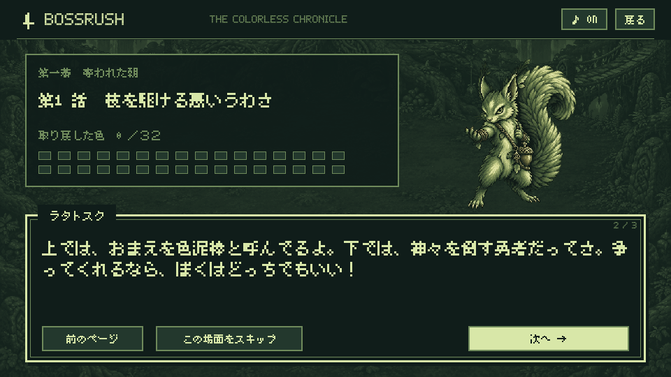

# メインストーリー「色を取り戻す旅」

1.0.15で、「はじめから」で始める冒険に序章・全32話・終章を追加しました。4職業とも主人公は**旅人**で、序章の決意の台詞が職業ごとに変わります。1回の冒険で序章6ページ、ボス前後162ページ、終章5ページの計173ページです。自動で読み進めることはありません。

## 物語

世界から色が消え、人々は空の青も花の赤も、言葉でしか知らなくなった。旅人は故郷で繕ってもらった布の色さえ忘れかけている。空の「旅灯」を受け取った旅人は、神々と眷属が持つ三十二の色の封印を解く旅へ出る。

色を支配する神々は、ただ力を誇る敵ではない。仕える主への忠義、失ったものへの怒り、傷つくことへの恐れ、未来を守ろうとする願いから旅人と対立する。旅人は、色を取り戻すことが喜びだけでなく、悲しみや危険をも返すことだと知ってゆく。

最後に問われるのは、新しい色の支配者になるか、集めたものを世界へ返すかという選択。会話の中で旅人が自分の答えを示す、一本道の物語です。選択肢による分岐や別エンディングはありません。

| 幕 | 話数 | 物語の焦点 |
| --- | --- | --- |
| 第一幕・奪われた朝 | 1〜8 | 光だけでなく、黒や夜も世界の色だと知る |
| 第二幕・境界の青 | 9〜16 | 所有と返還、死者の記憶、閉ざされた世界をめぐる対立 |
| 第三幕・終末の檻 | 17〜24 | 死、腐敗、裏切り、偽りの楽園、炎と向き合う |
| 第四幕・神々の選択 | 25〜32 | 育つ時間、愛、誓い、支配、守る責任を経て王の答えへ |

## 原典と創作の区別

参照した一次資料の英訳は、[『散文エッダ』R. B. Anderson訳・1901年版](https://www.gutenberg.org/files/18947/18947-h/18947-h.htm)と[『古エッダ』H. A. Bellows訳・1923年](https://www.gutenberg.org/files/73533/73533-h/73533-h.htm)です。本文は本作向けに書いた日本語の創作で、既存の日本語訳の転載ではありません。各話の原典参照箇所は台本と `MainStory.kt` に記録しています。

原典からは役割、関係、持ち物、逸話を用いています。例えば、世界樹で言葉を運ぶラタトスク、若返りの林檎を守るイズン、神々の偽りの約束で縛られたフェンリル、手を失ったテュール、知恵のために片目を差し出したオーディンです。資料の記述が短いダーイン等に、原典にない長い経歴があるとは扱っていません。

**色を封じた王、旅灯、32色の配分、旅人との会話や各人物の動機は本作独自の設定**です。原典そのものがこの筋書きを語っているわけではありません。時代をまたぐ存在が同じ旅に現れる理由は、序章で「封印が古い物語の怒りや願いを留め、倒れた巨人の姿も守り手にする」と説明しています。神話の出来事を一つの年代順に再現する構成ではありません。

## ゲーム内の流れと保存

1. 「はじめから」→職業選択→序章→第1話の対峙。
2. 対峙を読み終えると、従来のボス紹介・ギミック説明へ進む。
3. 戦闘後に技の強化・盗賊の戦利品を確定すると、撃破後の物語へ進む。
4. 撃破後の物語→ショップ→次のボスの対峙、の順で進行。
5. 第32話の撃破後、旅灯から色を解き放つと、フルカラーの背景で終章を表示。最後に既存のスコア画面へ進む。

「次へ」「前のページ」「この場面をスキップ」で操作します。スキップは現在の場面を読み終えた状態にするもので、ボス戦・強化・戦利品を飛ばしません。外部コントローラーではAで決定、十字キーでボタンを移動、Bでタイトルへ戻れます。

物語のページを送る／戻すたびに進行を自動保存します。「戻る」や端末の戻る操作からタイトルへ戻り、「つづきから」で同じページを開けます。会話中は戦闘時計・移動・攻撃を停止します。序章は無音、対峙は該当ボスの曲、撃破後はショップ曲、終章はエンディング曲です。タイトルは引き続き無音です。

強化・報酬を確定してから撃破後のページを保存するため、途中再開で再度ボスの報酬が加算されません。報酬を確定する前に冒険を離れた場合は、従来どおりそのボスの戦闘前からです。最終スコアの確定・クリア回数の加算は、終章を読み終えた時に一度だけ行います。

保存形式はversion 2。従来のversion 1も読み込み、獲得済みの報酬・レベル・所持品を保ったまま現在のボスから物語へ合流します。旧保存がショップならショップから、戦闘前ならそのボスの対峙から再開します。「はじめから」は序章から読み直す入口です。

## ドット文字

[Little Limitの美咲ゴシック](https://littlelimit.net/misaki.htm)（2021-05-05、Num Kadoma）を同梱しました。8×8ドットの日本語フォントで、ゲームボーイ期のRPGを思わせる文字の密度を狙っています。任天堂製のROMから取り出したフォントではなく、実際のゲームボーイ作品に採用されたという主張でもありません。

会話は8×8の文字タイルを最近傍で拡大し、960×540の最小表示領域でも本文を24論理ピクセル・最大4行に配置。会話枠の不透明な背景、話者名、ページ番号、閉じ括弧や句読点の禁則処理を設けています。ゲーム内の他の日本語表示も同じ字体へ変更しました。Android標準の確認ダイアログはシステム表示です。

フォントは[公式ライセンス](https://littlelimit.net/font.htm)で改変の有無・営利非営利を問わない利用と再配布が認められています。[同梱のライセンス原文・説明書](licenses/Misaki.txt)と[取得元・ハッシュ](../app/src/main/assets/fonts/manifest.json)を保存しています。フォントファイルは改変していません。

- [全32話の会話台本](STORY_SCRIPT.md)
- [序章・職業別台詞・終章を含む実装](../app/src/main/java/io/github/hatake716/bossrush/MainStory.kt)
- [動作検証と実機への反映](STORY_VALIDATION.md)

