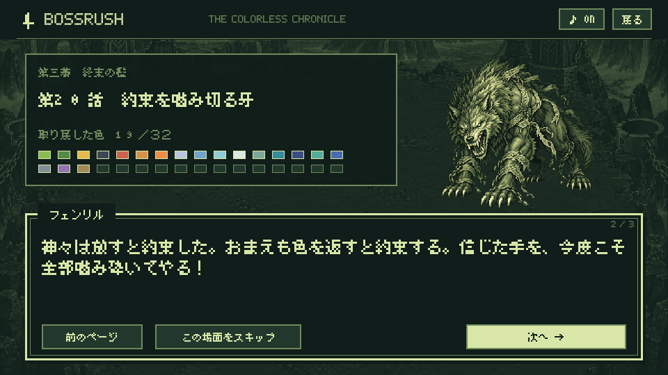

# メインストーリーの検証（1.0.15 / code 16）

2026-09-10に確認。物語・日本語フォント・保存形式を追加し、検証済みの開発署名APKをPixel 10aへ更新しました。戦闘バランス、1.0.14の音楽ファイル、タイトル無音の設定は変更していません。

## 物語と文字

- ボスの実際の並びと一致する全32話、異なる32色、各話の原典参照箇所を検査。
- 序章6ページ・各ボス前後162ページ・終章5ページ。4職業で序章の旅人の台詞が変わります。
- 全本文が最小の960×540論理画面で35文字×4行以内に収まり、禁則処理で文字が失われないことを検査。
- 同梱する美咲ゴシックのSHA-256、ライセンスファイル、物語に使う715種類の日本語・記号の実際のグリフを確認。Android上でも全会話の文字を確認。
- 全32体の対峙・撃破後の64場面を描画。序章、ラタトスク、フェンリル、オーディン、カラーの終章などの画像を保存し、代表画面の文字・背景・会話枠を目視確認。

原典と本作の創作設定は [STORY.md](STORY.md)、ボス前後の本文は [STORY_SCRIPT.md](STORY_SCRIPT.md) に記録しています。画像はエミュレーター上の画面または描画用の明示的な状態から取得しています。

## ビルドと自動検証

`./gradlew testDebugUnitTest lintDebug assembleDebug assembleDebugAndroidTest` 成功。JVMテスト **92件成功**。Lintエラー0件、警告30件（既存29件と、新しい文字描画の `Bitmap.createBitmap` に対する `UseKtx` 推奨1件）。

`check-art.py`、`check-backgrounds.py`、`check-music.py`、`check-story.py` 成功。従来の39人物画像・33背景・34曲と、新しい32話・フォントの整合性を確認しました。CIにも `check-story.py` を追加しています。

最終APKをインストールしたAndroidエミュレーターで **11件成功（160.606秒）**。

| 検証対象 | 件数 | 確認した内容 |
| --- | ---: | --- |
| `MainStoryUiTest` | 6 | 新規開始、前後のページ、場面スキップ、Activity再作成と同ページ再開、報酬確定後の再開、次のボス、終章からスコア確定、旧保存の移行、不正なページ番号の拒否、全会話描画、場面ごとのBGMと無音 |
| `ControllerTest` の冒険開始テスト | 1 | タッチを使わない新規開始、Aで会話を送る操作、戦闘・移動・一時停止 |
| `GameplayTest` の4職業操作・成長取消テスト | 2 | 4職業の操作と背景移行、強化の選び直し・キャンセル・確定・保存 |
| `FullscreenTest` | 2 | 5種類の画面寸法・切り欠き条件で全画面の操作枠、実際の左右横画面回転、端のボタン操作 |

JVMでは32戦すべてを進めて、撃破後・ショップ・次の対峙・終章の順序、各ページの保存、途中再開でレベル・お金・スコアを二重加算しないことを検査。Androidでは4職業×32体の対峙・撃破後の保存形式も往復検証しています。

撃破・最終戦の分岐には明示的なテスト用状態を使っています。32体を手動で倒し切った結果ではありません。コントローラー入力もエミュレーターでのAndroid入力イベントによる確認で、実物の外部コントローラーの接続確認とは区別します。

## Pixel 10aへの反映

検証済みの同じAPKを `adb install --no-incremental -r` で1.0.14から更新。1.0.15 / code 16、インストールされた `base.apk` と配布APKのSHA-256一致を確認しました。

起動応答は `Status: ok`、`MainActivity` が最前面のResumed状態。起動後の本アプリのログに `FATAL EXCEPTION` はありません。Androidの `InteractionJankMonitor` に診断用権限不足の警告1件があります。

保存データの更新直前と更新後のSHA-256は一致：`c3de0b6ec3df16e83d610cb8bac400677fc33f947ee09669ce0d72397a0bac8e`。新しい冒険を開始する操作はしていないため、端末にあった冒険は保持されています。

実機へのタッチ・キー操作注入は行っていません。実機で物語を読み進めた際の使用感は、インストール・起動・保存保持の確認と区別します。

## 成果物

- 開発APK：`artifacts/delivery/story-1.0.15/BOSSRUSH-1.0.15-debug.apk`（173,596,849 bytes）。
- APK SHA-256：`3d4e892f4f60f6fabcac416d034f09d2b9c62f678c287eac3f8ecac4523dd95b`。
- 署名証明書 SHA-256：`2c53b411c1193758289715cc230989564a571259b2eb4f5702b774c07a515e87`。
- ビルド・Lint・Android・署名・実機の検証記録：`artifacts/delivery/story-1.0.15/`。
- 会話画面の取得画像：`artifacts/story-1.0.15/final-story-screenshots/`。

