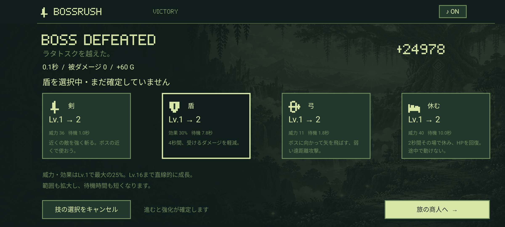
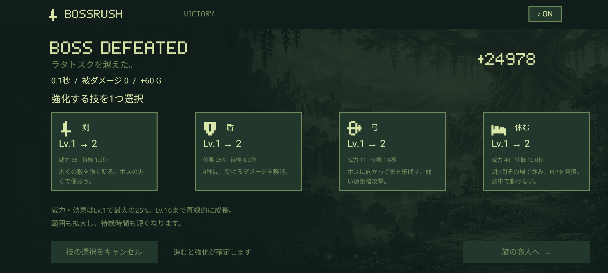

# BOSSRUSH 1.0.10 検証記録

検証日：2026-09-09。Android 8.0以上、applicationId `io.github.hatake716.bossrush`、versionName `1.0.10`、versionCode `11`。

## 修正内容

戦闘後に技を選ぶと即座にレベルが上がり、選択をキャンセルできない不具合を修正しました。技の選択を仮状態にし、別の技への選び直し、「技の選択をキャンセル」、Androidの「戻る」、コントローラーのB／キーボードのEscで取り消せます。選択中の枠と強化後の効果をプレビューし、「旅の商人へ」（最終戦は「夜明けへ」）で選んだ技だけを1レベル上げます。

確定前は実際のレベル・威力・保存データを変更しません。確定は保存・結果通知より先に行い、連打で二重加算しないようにしています。盗賊の戦利品と技の仮選択を分け、技を取り消しても受け取ったアイテムや交換待ちのアイテムを失いません。Lv.16の技は選択できません。[操作方法](CONTROLS.md)。

## ビルドと単体テスト

```sh
./gradlew testDebugUnitTest lintDebug assembleDebug assembleRelease assembleDebugAndroidTest
```

- Debug／Release／AndroidテストAPKのビルド成功。ReleaseはR8最適化・リソース縮小を含む未署名APK。
- 単体テスト：**65件成功、失敗0件**。追加した4件は、4職業での選択・再選択・取消、確定と保存の順番・二重加算防止・Lv.16上限、盗賊の戦利品との独立、最終戦での確定と仮選択の初期化を検査。
- 32戦の進行、ボス移動、攻撃・回避・音楽・入力など、既存の単体テストも成功。
- Lint Debug：**エラー0、警告27**。
- 既存と同じDebug署名証明書と16 KB zipalignを確認。
- `git diff --check` とローカルMarkdownリンクの確認成功。

## エミュレーター

API 35 / x86_64、対象 `emulator-5554`。今回の変更に関連する **11件が成功、失敗0件、204.266秒**。

```sh
adb -s emulator-5554 shell am instrument -w -r \
  -e class io.github.hatake716.bossrush.GameplayTest,io.github.hatake716.bossrush.ControllerTest,io.github.hatake716.bossrush.FullscreenTest \
  io.github.hatake716.bossrush.test/androidx.test.runner.AndroidJUnitRunner
```

- **GameplayTest：5件**。追加した回帰テストでは全4職業で、技の選択、別の技への変更、キャンセルボタン、Androidの「戻る」、確定、Activity再起動後の保存復元を確認。報酬画面の準備にはテスト用の撃破状態を使っています。
- 既存のタッチ操作では戦士で最初のボスを撃破し、強化・買い物・保存再開まで確認。4職業の操作、バックグラウンド停止・復帰、図鑑、盗賊の戦利品とエンディングも確認。終盤はテスト用状態を使用。
- **ControllerTest：4件**。仮選択でレベルが変わらず、同じ技でAを再度押しても確定されないこと、Bで取り消せること、別の技を選んで商人へ進むとその技だけが強化されることを確認。既存の戦闘・メニュー・アイテム操作も成功。
- **FullscreenTest：2件**。各画面比率、左右のカメラ穴、画面端のボタンの表示・操作を確認。
- 戦士・盗賊の選択中の画面を目視し、枠・未確定表示・取消ボタンに重なりや見切れがないことを確認。

今回の操作テストはエミュレーター上のAndroid入力です。物理ゲームパッドの接続試験とは区別しています。キャラクター・背景・戦闘エフェクト専用のAndroidテストは再実行していません。[1.0.9の描画・戦闘検証](https://github.com/hatake716/bossrush/blob/75abec8c6e8b245a2a25aa1013fa816e1c198be1/docs/VALIDATION.md)も参照してください。

ログ：`artifacts/instrumentation-reward.txt`。4職業の取消前後の画像：`artifacts/screenshots/growth-*.png`。





## Pixel 10aへの更新

エミュレーターで検証したAPKを `adb install --no-incremental -r` で **1.0.9から1.0.10へ更新**しました。

- インストール：`Success`。
- 起動：`Status: ok`、534 ms。前面Activityとプロセス生存を確認。
- versionName `1.0.10` / versionCode `11` を確認。
- SharedPreferencesの更新前後のSHA-256が一致。既存の保存データを維持。
- 実機・検証したエミュレーター・引き渡しAPKのSHA-256が一致。
- 確認時点のアプリプロセスにクラッシュ・ANRのログなし。
- 物理端末へのタップ・スワイプ・キー入力の注入なし。実機では更新と起動を確認し、操作はエミュレーターで検証しています。

証跡：`artifacts/delivery/physical-install-1.0.10.json`。

## 引き渡しAPK

`artifacts/delivery/BOSSRUSH-1.0.10-debug.apk`

```text
サイズ：154,528,138 bytes（約147.37 MiB）
SHA-256：70e5c8d27b48ade49fe7cc6dcc344419593bf047950970d38f8fedf11c3435c5
署名：Android Debug
署名証明書 SHA-256：2c53b411c1193758289715cc230989564a571259b2eb4f5702b774c07a515e87
zipalign -c -P 16 4：成功
```

APKはGitへ含めず、ローカルの引き渡し用フォルダに保存しています。GitHub Actionsは画像検査・単体テスト・Lint・ビルドを行います。CIのDebug APKは別の署名を使うため、ローカルAPKとはハッシュ・署名が異なります。
